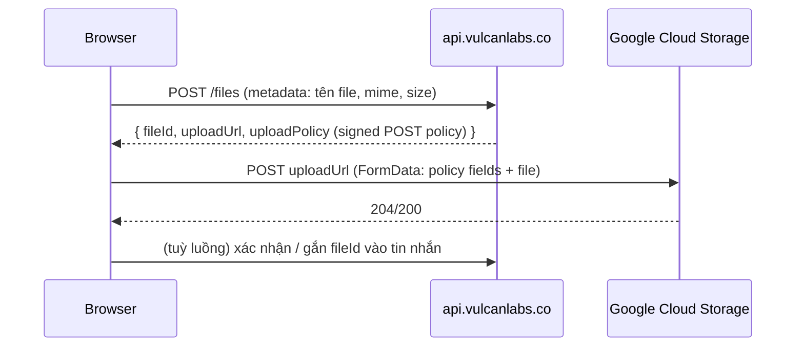

# `@cs/api-client` — Kiến trúc

> Nguồn tham chiếu về thiết kế của `@cs/api-client` — lớp giao tiếp duy nhất giữa mọi app Next.js trong monorepo với backend `api.vulcanlabs.co`. Hướng dẫn dùng hàng ngày (gọi endpoint, thêm domain mới, checklist merge) nằm ở [`packages/api-client/README.md`](../../packages/api-client/README.md) — không lặp lại ở đây.

## 1. Ràng buộc phải thiết kế đúng ngay từ đầu

- **Khác apex domain**: `chatsmith.io` ≠ `vulcanlabs.co` — cookie đặt trên domain này không bao giờ được trình duyệt tự gửi sang domain kia.
- **Lỗi backend dạng gRPC-shaped**, có `reason` là enum tùy biến, cần map sang i18n.
- **Auth qua Firebase**: client lấy Firebase ID token rồi "đổi" (exchange) lấy access/refresh token của Vulcan.
- **Deploy trên GKE**: nhiều pod song song, không sticky-session, không pod nào được giữ state trong RAM.
- **Có chat/streaming, upload file** — traffic lớn, transport phải tiết kiệm băng thông và không bắt buộc đi qua hạ tầng của chính mình.

## 2. Quyết định kiến trúc cốt lõi

### 2.1 Direct-to-backend là mặc định

Client Component gọi thẳng `api.vulcanlabs.co` bằng `Authorization: Bearer <access_token>` (cross-origin, không cookie xuyên domain) — **không** mặc định qua BFF proxy. Server Components/Actions vốn đã chạy phía server nên luôn gọi thẳng.

**Vì sao**: Chat Smith có khối lượng streaming/upload lớn — bắt mọi traffic đi qua 2 hop (browser → pod Next.js → backend) sẽ khiến hạ tầng Next.js gánh toàn bộ băng thông sản phẩm, tăng chi phí và độ trễ mỗi token. `transport` là cấu hình theo **từng endpoint** (không phải toàn app), nên 1 service chưa được backend mở CORS chỉ cần đặt `transport: "proxy"` riêng cho nó — nơi khác không đổi. Cơ chế proxy tổng quát (`proxy/route-handler.ts`, 1 route xử lý mọi service qua `[...path]`) vẫn được giữ làm escape hatch.

**Đã xác nhận với backend**: CORS cho `https://chatsmith.io` đã bật, header `Authorization` đã whitelist, platform "web" đã được hỗ trợ, Firebase App Check Web đã đăng ký cho project.

|  | Direct (mặc định) | Proxy qua BFF (escape hatch/endpoint) |
| --- | --- | --- |
| Access token | Ngắn hạn, nằm trong memory JS | Không bao giờ lộ ra client |
| Số hop mạng | 1 | 2 |
| Băng thông hạ tầng của bạn | Chỉ tốn cho RSC | Tốn cho toàn bộ traffic API |
| Yêu cầu CORS backend | Bắt buộc | Không cần |
| Phù hợp khi | Traffic cao/streaming/upload | Backend chưa mở CORS, cần giấu topology, rate-limit tập trung |

## 3. Token lifecycle & xác thực

### 3.1 Luồng exchange Firebase → Vulcan

1. Client đăng nhập Firebase Auth SDK → nhận Firebase ID token.
2. Client `POST` token tới Route Handler `app/api/auth/session/route.ts` (same-origin).
3. Handler gọi backend server-to-server để đổi lấy `{access_token, refresh_token}`. Backend **không trả `expires_in` tường minh** — handler tự giải mã JWT lấy claim `exp` để tính TTL.
4. Handler set 2 cookie **httpOnly, Secure, SameSite=Lax, Domain=chatsmith.io**: `refresh_token` (TTL dài) và `access_token` mirror (TTL ngắn, dùng riêng cho Server Components — mục 3.3). Đồng thời trả `{access_token, accessTokenExpiresAt}` trong JSON body để client nạp vào memory ngay.
5. Client lưu `access_token` **chỉ trong memory** (`TokenManager`, không React state, không `localStorage`) — tránh XSS đọc được token tồn tại lâu dài trên đĩa.

### 3.2 Vì sao access token trong memory không xung đột với GKE nhiều pod/nhiều tab

- **Nhiều pod**: sau response exchange, access token không còn tồn tại ở RAM tiến trình nào — toàn bộ state đi theo request dưới dạng cookie, không cần sticky session hay Redis.
- **Nhiều tab**: mỗi tab có vùng nhớ JS riêng — đây là bài toán đồng bộ (mục 3.3), không phải bảo mật, nên không cần chuyển token sang chỗ lưu bền hơn.

### 3.3 Refresh-token rotation không có grace period — ràng buộc quan trọng nhất hệ thống

**Đã xác nhận với backend**: hoàn toàn không có grace period — tại một thời điểm chỉ đúng 1 request refresh được phép thành công cho cùng 1 refresh token; request thứ 2 gần như đồng thời bị từ chối cứng. Thiết kế bắt buộc để tuân thủ:

1. **Cookie `access_token` mirror** (mục 3.1 bước 4) — mỗi request SSR đọc cookie này trước, chỉ refresh thật khi thiếu/hết hạn. Loại bỏ phần lớn race giữa SSR và browser tự refresh.
2. **Single-flight trong 1 tab**: `TokenManager` giữ đúng 1 `Promise` refresh đang chạy — mọi request 401 cùng lúc chờ chung promise này.
3. **[Web Locks API](https://developer.mozilla.org/en-US/docs/Web/API/Web_Locks_API) giữa các tab cùng trình duyệt**: chỉ 1 tab thực sự gọi refresh; tab khác chờ lock rồi kiểm tra qua `BroadcastChannel` xem token mới đã có chưa. Bắt buộc, không phải "giảm thiểu tốt hơn" — thiếu nó, 2 tab hết hạn cùng lúc gần như chắc chắn có 1 tab bị văng ra.
4. **Proactive refresh sớm 60–90 giây trước `exp`** (mục 3.4) — thu hẹp tối đa cửa sổ có thể race, vì không có grace period nên chiến lược đúng là gần như không bao giờ để token thực sự hết hạn.
5. **Residual race ngoài phạm vi Web Locks** (khác thiết bị, hoặc giữa browser và SSR pod — Node.js không tham gia được `navigator.locks`): request thua cuộc mặc định coi là phải đăng nhập lại, không retry vô hạn. Tần suất thấp, chấp nhận được, theo dõi qua log.
6. **Cố tình không dùng Redis/distributed lock** cho race giữa các pod GKE — cookie mirror ở điểm 1 đã giảm gần hết nhu cầu đó; chỉ cân nhắc thêm khi có dữ liệu telemetry chứng minh cần thiết.

### 3.4 Proactive refresh

Ngay sau khi có `{access_token}`, `TokenManager` giải mã JWT lấy `exp` để tính thời điểm hết hạn, lên lịch 1 timer refresh chủ động tại `exp - SAFETY_BUFFER` (60–90s) — không chờ tới khi request thật nhận 401. Refresh phản ứng (khi 401 xảy ra bất ngờ) vẫn giữ làm lớp phòng vệ thứ 2, dùng chung single-flight với refresh chủ động.

### 3.5 Guest/anonymous session

`TokenManager` hỗ trợ 2 identity mode: `authenticated` (đã exchange Firebase) và `guest` (session ẩn danh do backend cấp, không qua Firebase) — dùng chung interceptor pipeline (đính header, refresh, retry-once), khác nhau ở nguồn cấp/gia hạn token. Xem `server/guest/*` (`bootstrapGuestSession`, `createGuestSession`, `refreshGuestSession`) và các route `app/api/anon/session/*` trong `apps/web`.

## 4. Kiến trúc xử lý lỗi

Shape lỗi backend cố định (gRPC-style):

```json
{
  "code": 16,
  "reason": "ERROR_TOKEN_FIREBASE",
  "message": "Token AppCheck is invalid",
  "status": "UNAUTHENTICATED",
  "details": [
    {
      "reason": "ERROR_INVALID_APPCHECK",
      "http_status_code": 400,
      "metadata": { "error": "..." }
    }
  ]
}
```

- **`ApiError`** (`errors/api-error.ts`) chuẩn hoá cả lỗi transport (network, timeout, JSON parse fail) lẫn lỗi backend về đúng 1 shape: `{ code, reason, status, httpStatus, message, details, isRetryable, cause }`.
- **`errors/reasons.ts`** map 1-1 `reason` → `{ httpStatus, retryable, category, i18nKey }`. Thêm 1 `reason` mới = thêm 1 dòng vào bảng này, không phải viết thêm nhánh `if`.
- **401 là trường hợp đặc biệt**, không đi qua retry logic chung — nó kích hoạt refresh-and-retry-once (mục 3): request → 401 → chờ single-flight refresh → gọi lại request gốc đúng 1 lần với token mới → vẫn 401 thì trả lỗi thẳng ra, không lặp vô hạn.

## 5. i18n cho thông báo lỗi

`@cs/i18n` (next-intl) dùng key hash tự sinh cho hầu hết chuỗi tĩnh — nhưng thông báo lỗi API đến từ `reason`, 1 giá trị **động** lấy từ response lúc runtime, nên không đi qua pipeline extraction/hash (đúng ["explicit-ids" escape hatch của next-intl](https://next-intl.dev/docs/usage/extraction#explicit-ids)).

**Convention**: namespace `ApiErrors` trong mọi `messages/{locale}.json`, key = **chính xác giá trị `reason`** trả về từ backend (ví dụ `ApiErrors.ERROR_TOKEN_FIREBASE`) — không cần bảng map trung gian thứ 2, `reasons.ts` chỉ phát `i18nKey = \`ApiErrors.${reason}\``bằng 1 dòng code. Luôn có`ApiErrors.UNKNOWN`làm fallback cho`reason` chưa thêm vào bảng.

```json
{
  "ApiErrors": {
    "ERROR_TOKEN_FIREBASE": "Your session has expired. Please sign in again.",
    "UNKNOWN": "Something went wrong. Please try again or contact support."
  }
}
```

```ts
const t = useTranslations("ApiErrors");
const message = t.has(error.reason) ? t(error.reason) : t("UNKNOWN");
```

## 6. Cấu trúc package

```
packages/api-client/                 (@cs/api-client)
  src/
    core/            transport thuần — không domain nào biết đến file khác domain
      http-client.ts     # fetch wrapper: header, AbortController/timeout, parse JSON/text/blob, camelCase<->snake_case
      token-manager.ts   # single-flight + proactive refresh + Web Locks/BroadcastChannel đa tab
      interceptors.ts     # gắn header auth, refresh-and-retry-once trên 401
      retry.ts             # backoff + phân loại retryable dựa theo reasons.ts
      sse.ts               # SSE named-event thật qua eventsource-parser (KHÔNG dùng EventSource gốc — không gắn được Authorization header)
      polling.ts           # poll process/job tới khi done/error, tự pause khi offline
      upload.ts            # 2 bước: lấy signed policy rồi PUT/POST thẳng lên GCS
      process-storage.ts   # persist processId đang pending vào localStorage (resumability)
      query-client.ts      # getQueryClient() dùng được từ Server Component (không "use client")
    errors/            api-error.ts, reasons.ts
    endpoints/         registry.ts (defineService/.endpoint — cơ chế, ổn định) + types.ts
    utils/             build-url, case-convert, decode-jwt, envelope, parse-response, runtime-env
    services/          data — 1 THƯ MỤC/domain, nơi duy nhất cần chạm khi thêm/sửa endpoint
    server/            "server-only" — server-fetch, cookies, guard, prefetch, guest/*
    proxy/             route-handler.ts — factory route BFF tổng quát cho transport: "proxy"
    hooks/             use-api-query, use-api-mutation, use-process
    providers/         query-client-provider.tsx (ApiQueryProvider), auth-provider.tsx (ApiAuthProvider/useApiAuth)
    types/             type dùng chung toàn package
```

`package.json` khai báo `exports` theo từng subpath (`./core/*`, `./hooks/*`, `./providers/*`, `./errors/*`, `./server/*`, `./proxy/*`, `./utils/*`, `./endpoints/*`, `./services/*`) — không có barrel file gộp nhiều domain không liên quan.

**Vì sao tách `services/` khỏi `endpoints/`**: `endpoints/` chỉ là **cơ chế** (registry builder + types), ổn định, không đổi khi thêm domain. `services/` là **dữ liệu** — nơi duy nhất cần chạm khi thêm/sửa 1 domain. Gộp chung 2 khái niệm này khiến `endpoints/` phình to và lẫn "framework" với "instances".

**Domain gộp nhiều sub-domain không liên quan** (`conversation`: CRUD + chat + ảnh + citation + model catalog; `design-studio`: project + upload + ảnh + template + quota + message + stream) tách thành nhiều file theo sub-domain — mỗi file con export hằng số `EndpointConfig<Input, Response>` (thuần data), `index.ts` mới thật sự gọi `defineService(...).endpoint(name, config)...` để lắp ráp lại thành 1 object duy nhất, vì `.endpoint()` là 1 chuỗi fluent trên cùng 1 object, không "nối" được giữa nhiều file.

## 7. Escape hatch khi thêm endpoint (ngoài quy trình chuẩn ở README)

`path` không gồm tiền tố `/api/{version}` — `buildUrl()` tự ghép `{service}/api/{version}/{path}` từ `service`/`version` khai báo ở `defineService`/`.endpoint()`.

**Service có path convention bất thường** (vd. `notification` không dùng tiền tố `/api`, ghép trực tiếp `${CS_PUBLIC_API_BASE_URL}/notifications/v1/...`): khai báo `pathPrefix` tùy chỉnh cho riêng service đó.

```ts
export const notification = defineService("notification", {
  pathPrefix: "/notifications",
}).endpoint("getList", { method: "GET", path: "/v1/notifications/get-list", ... });
```

**Version động trong path** (vd. `product` nhận `apiVersion` làm tham số runtime):

```ts
.endpoint("getByAppId", {
  method: "GET",
  path: (input: { apiVersion: string; appId: string }) =>
    `/${input.apiVersion}/users/apps/${input.appId}/subscriptions`,
  auth: "required",
})
```

**Response backend trả camelCase thay vì snake_case** (đã gặp ở `message-feedback`): đặt `skipBodyCaseConversion: true` trên endpoint đó để bỏ qua transform toàn cục.

**Nhiều version cùng 1 nghiệp vụ** (`v1`/`v2`) không cần nhân bản DTO — chỉ khác `version`/`responseSchema`:

```ts
.endpoint("list", { method: "GET", path: "/users/web/conversations", version: "v1", responseSchema: ConversationListV1Schema })
.endpoint("listV2", { method: "GET", path: "/users/web/conversations", version: "v2", responseSchema: ConversationListV2Schema })
```

## 8. Upload file

Presigned URL, không qua BFF:



`core/upload.ts` gói 2 bước này thành `uploadFile(file, { onProgress })` — dùng `XMLHttpRequest` (không phải `fetch`) cho leg POST lên GCS vì `fetch` không expose upload progress.

## 9. Tác vụ chạy lâu: poll-based và SSE thật

`conversation`/`research` (service `smith-engine`) chưa có SSE thật — chat/deep-research/image-to-image trả `process_id` rồi client poll `.../processes/{id}` cho tới `status: done | error`. `design-studio` (creative-studio) là domain **duy nhất có SSE thật**: `GET .../messages/{messageId}/stream`, khung SSE chuẩn với `event:` tên riêng (`analysis.ready`, `generating`, `output.ready`, `message.done`, `message.error`, `stream.error`, `ai.error`).

`useProcess()` (`hooks/use-process.ts`) trừu tượng hoá cả 2 transport sau 1 interface — đổi `transport: "poll" | "sse"` là đổi cách gọi ở call site, không sửa `core/sse.ts`/`core/polling.ts`.

- `poll`: dừng khi có `status: done | error`, tự pause khi offline/resume khi có mạng lại (`core/polling.ts`); 1 lỗi transient đã hết retry không kết thúc phiên poll.
- `sse`: đọc `fetch` + `ReadableStream`, parse bằng `eventsource-parser` (không dùng `EventSource` gốc — không gắn được header `Authorization`). Tự **reconnect** (giữ cursor qua `Last-Event-ID`) khi stream đứt giữa chừng mà chưa nhận terminal event; đặt `reconnect: false` để tự xử lý UI retry.
- `design-studio` có nhiều event mang payload khác shape nhau trong 1 stream — `useProcess()` chỉ phù hợp khi 1 stream có đúng 1 dạng payload; dùng thẳng `openMessageStream()`/`subscribeSse()` từ `services/design-studio/stream.ts` để phân loại theo tên event.

**Resumability**: job chạy trên backend, không phụ thuộc client còn mở hay không. `useProcess()` nhận `persistKey` (vd. `conversation:${conversationId}`) — khi có, tự lưu `{processId, transport, startedAt}` vào `localStorage` (`core/process-storage.ts`) lúc job còn `pending`, tự xoá khi job đạt trạng thái cuối hoặc caller gọi `cancel()`. Unmount đơn thuần (điều hướng đi rồi quay lại) không xoá entry. Đọc lại bằng `loadPendingProcess(persistKey)` lúc mount để quyết định `processId` ban đầu — ví dụ ở README mục "Các trường hợp đặc biệt".

## 10. Data fetching pattern (Client vs Server) — quyết định đầy đủ

Ví dụ cơ bản dùng `useApiQuery`/`useApiMutation`/`serverFetch` xem README. Phần dưới là quyết định **prefetch từ Server Component hay không** — đọc trước khi thêm 1 data-fetching mới, trả lời tuần tự, dừng ở câu đầu tiên áp dụng được:

1. **Write/mutate?** → `useApiMutation`, không prefetch 1 mutation.
2. **Việc chạy lâu, có `process_id`/SSE?** → `useProcess`/`openMessageStream` (mục 9), không phải pattern dưới đây.
3. **Endpoint có `auth: "required"`?**
   - **Có** → luôn `useApiQuery` client-only, không prefetch. Đây là kết luận sau khi đã thử prefetch + `HydrationBoundary` và đo được rủi ro cụ thể (xem 🛑 bên dưới). `prefetchServerQuery()` tự throw nếu gọi nhầm endpoint loại này.
   - **Không** → câu 4.
4. **Dữ liệu giống nhau cho mọi user, tương đối ổn định?**
   - **Có** → cân nhắc `"use cache"` của Next trước (cache chéo request thật — `QueryClient` phía server là instance mới mỗi request, không cache chéo được). Dùng prefetch dưới đây khi cần tránh waterfall lần load đầu VÀ vẫn muốn client tiếp quản qua `useApiQuery`. Ví dụ đã áp dụng: `apps/web/app/[locale]/design-studio-templates/page.tsx`.
   - **Không** (theo tham số nhưng vẫn public) → `prefetchServerQuery()` + `HydrationBoundary` bên dưới.
5. **Component nằm trong 1 segment dễ remount vì lý do không liên quan** (vd. dưới `[locale]/layout.tsx` — đổi ngôn ngữ remount toàn bộ)? Nếu có, chi phí prefetch bị trả mỗi lần remount đó — thiên về client-only trừ khi có lý do SEO/first-paint rõ ràng.

```tsx
// page.tsx — Server Component, KHÔNG render data, chỉ prefetch + bàn giao
import { getQueryClient } from "@cs/api-client/core/query-client";
import { prefetchServerQuery } from "@cs/api-client/server/prefetch";
import { HydrationBoundary, dehydrate } from "@tanstack/react-query";

export default async function Page() {
  const queryClient = getQueryClient();
  await prefetchServerQuery({
    endpoint: productCatalog.getFeatured, // throws nếu auth: "required"
    queryClient,
    queryKey: ["product-catalog", "featured"],
  });
  return (
    <HydrationBoundary state={dehydrate(queryClient)}>
      <FeaturedProducts /> {/* Client Component, useApiQuery cùng queryKey */}
    </HydrationBoundary>
  );
}
```

- Luôn dùng `prefetchServerQuery()`, không tự viết `queryClient.prefetchQuery()` tay — nó unwrap `ApiResult` đúng cách và chặn cứng endpoint `auth: "required"`.
- `queryKey` phải giống 100% giữa prefetch và `useQuery` phía client.
- Component render (Client Component) là nguồn render duy nhất — server chỉ prefetch, không quyết định UI ([advanced-ssr guide](https://tanstack.com/query/latest/docs/framework/react/guides/advanced-ssr)).
- `staleTime` phải > 0 (đã set `60_000` mặc định ở `core/query-client.ts`), nếu không client coi data hydrate là stale ngay và fetch lại lập tức.

> ⚠️ Import `getQueryClient` từ `core/query-client`, không phải `providers/query-client-provider` (có `"use client"`) — gọi từ Server Component qua đường đó lỗi build.

> 🛑 **Cache Components (`cacheComponents: true`) + prefetch có side effect (auth `required` → token refresh) = rủi ro thật, đã verify bằng test trực tiếp.** TanStack Query tự gọi `Date.now()` mỗi khi 1 query settle, trigger `NEXT_PRERENDER_INTERRUPTED` khiến Next speculative re-invoke lại Server Component đó thêm lần nữa. Với 1 query gọi `serverFetch()` tới endpoint `auth: "required"` mà token đã hết hạn, mỗi lần re-invoke là **1 lần refresh-token rotation thật** — verify: 1 page load ra 3 lần refresh thật thay vì 1. Backend không có grace period (mục 3.3) nên đây có thể làm hỏng phiên thật, không chỉ lãng phí. Đây là lý do `prefetchServerQuery()` throw cứng thay vì chỉ cảnh báo trong docs.
>
> **Bug tương tự, nguồn khác**: `queryClient.setQueryData()` cũng stamp `Date.now()` — dùng `"use cache"` rồi `setQueryData()` thay vì `prefetchQuery()` **không** tránh được bug này (verify trên `design-studio-templates/page.tsx`). **Fix**: bọc phần code đụng `QueryClient` trong 1 component gọi `await connection()` (từ `next/server`) rồi đặt sau `<Suspense>` — opt subtree đó ra khỏi prerender tĩnh, trì hoãn tới lúc request thật. Ví dụ: `TemplatesHydrator` trong `apps/web/app/[locale]/design-studio-templates/page.tsx`.

**Trước khi tin lý thuyết — verify bằng browser thật.** Cả 2 phát hiện 🛑 ở trên ra từ test trực tiếp, không phải đọc docs mà biết trước. Với pattern fetch mới có khả năng chạy lại nhiều lần ngoài dự kiến, verify tối thiểu 2 kịch bản trước khi merge: cold load (đếm request thật tới backend) và 1 hành động gây remount không liên quan (đổi ngôn ngữ/theme) — đếm lại, phải ra đúng số dự kiến.

**Chưa dùng — cần verify trước khi cân nhắc**: dehydrate query đang pending (TanStack ≥ 5.40, streaming, chưa test với `cacheComponents: true` của app này); `@tanstack/react-query-next-experimental` (tự nhận tái tạo lại waterfall lúc client-side navigation — app này đã chọn model server-shell + streaming qua Cache Components/PPR nên không cần); nhiều Server Component con cùng cần prefetch trên 1 page (chưa có domain nào cần, khi có thì dùng `Promise.all`, không `await` tuần tự).

## 11. Kiểm thử & checklist xác minh

- Unit test `reasons.ts`: mọi `reason` ở mục 4 đều có mapping.
- Unit test `TokenManager`: bắn nhiều request 401 đồng thời trong 1 tab → chỉ đúng 1 lần gọi refresh (single-flight).
- Integration test: mock backend trả đúng shape lỗi gRPC, assert `ApiError` chuẩn hoá đúng và `i18nKey` resolve đúng.
- Test thủ công: đăng nhập → set access token TTL ngắn ở env test → nhiều tab, bắn request đồng thời → xác nhận chỉ 1 lệnh gọi refresh thực sự chạy (Web Locks + BroadcastChannel) → xác nhận reconnect/retry khi 1 luồng poll/SSE bị rớt giữa chừng.
- Test upload: giả lập lỗi ở bước lấy signed policy và bước POST GCS riêng biệt.
- Test resumability: bắt đầu `useProcess({ persistKey })` đang `pending`, unmount (không `cancel()`) → `loadPendingProcess()` vẫn trả entry đã lưu; mount lại → tiếp tục nhận update; `cancel()` hoặc job `done`/`error` → entry bị xoá.

## 12. Troubleshooting

**Vì sao response không tự "unwrap" field `data`?** Transport layer không đoán shape — khai báo tường minh trong `responseSchema` của endpoint (dùng `unwrapEnvelope()` nếu backend bọc trong 1 key).

**Vì sao gọi trực tiếp từ Client Component tới `api.vulcanlabs.co` bị lỗi CORS?** CORS + platform web + App Check Web đã xác nhận bật cho toàn hệ thống (mục 2.1) — lỗi này nhiều khả năng do 1 service/môi trường cụ thể cấu hình thiếu. Kiểm tra header response của đúng service đó; nếu cần thời gian để backend sửa, đặt tạm `transport: "proxy"` cho riêng service đó.

**Vì sao đăng xuất ở 1 tab không làm tab khác đăng xuất ngay?** `TokenManager` broadcast qua `BroadcastChannel`; tab không active sẽ đồng bộ ở lần request tiếp theo (refresh token cookie đã xoá → 401 → coi như đã logout).

**Vì sao không dùng `EventSource` cho SSE?** Không cho phép gắn header `Authorization` tuỳ chỉnh — bắt buộc `fetch` + `ReadableStream` tự parse khung SSE (mục 9).

## 13. Endpoint kế thừa từ code cũ (`apps/super-app`)

`apps/super-app` là app cũ, chỉ giữ lại để tham chiếu — không phải workspace member, không build/deploy. Tác động còn lại tới `@cs/api-client` hôm nay:

- Không có SSE thật cho hầu hết domain — `conversation`/`research` vẫn poll-based, chỉ `design-studio` có SSE thật (mục 9).
- 1 base URL duy nhất (`CS_PUBLIC_API_BASE_URL`), service là 1 path segment — không phải 1 env var/microservice như code cũ.
- Zod Mini schema thay class-transformer, 1 `ApiError` chuẩn thay 4 kiểu lỗi trùng lặp, registry khai báo thay repository viết tay 2 lần.

Danh mục endpoint đầy đủ (path, service segment, ghi chú field/response bất thường đã xác nhận thật với backend) không còn cần liệt kê ở đây — toàn bộ đã hiện thực trong `src/services/*`, đó mới là nguồn đáng tin cậy nhất. Vài điểm đáng nhớ khi đối chiếu với code cũ nếu cần:

- **`payment`/`order`/`product`** mỗi domain đọc field response bọc ngoài khác nhau (`extended`/`items`/`data`) trong code cũ — không còn là vấn đề ở registry mới vì mỗi endpoint tự khai báo `responseSchema` đúng shape của nó.
- **`notification`** không theo convention `/api/{version}` — dùng `pathPrefix` (mục 7); giá trị `platform` trong push-token là chữ thường `"web"`.
- **`product`'s `getByAppId`** dùng version động trong path (mục 7); query `subscriptionSource` thật là `"SUBSCRIPTION_SOURCE_ECOSYSTEM"`.
- **`design-studio`** dùng `pathPrefix: "/creative-studio/v1/creative"`; `renameProject` trả project không bọc envelope (khác `create`/`get`).
