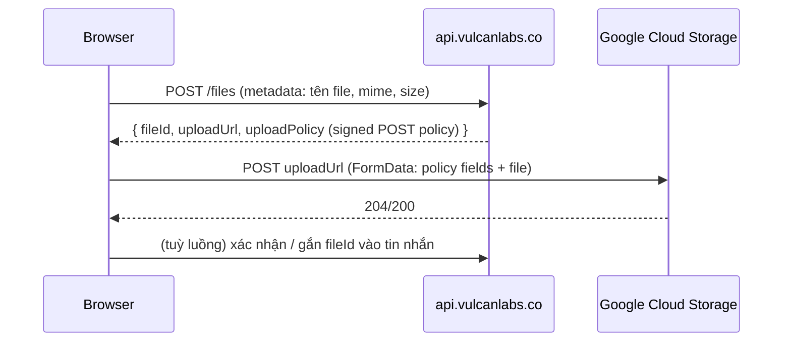

# `@cs/api-client` — Kiến trúc API Client dùng chung cho các app Next.js

> Tài liệu này là nguồn tham chiếu chính thức (living document) cho package `@cs/api-client` — lớp giao tiếp duy nhất giữa mọi app Next.js trong monorepo này với backend `api.vulcanlabs.co`. Viết cho cả kỹ sư mới lẫn AI agent đọc và thực thi độc lập, không cần hỏi lại ngữ cảnh.

---

## Mục lục

1. [Bối cảnh & vấn đề cần giải quyết](#1-bối-cảnh--vấn-đề-cần-giải-quyết)
2. [Vì sao source code cũ (`temp/`) chưa tốt](#2-vì-sao-source-code-cũ-temp-chưa-tốt)
3. [Quyết định kiến trúc cốt lõi](#3-quyết-định-kiến-trúc-cốt-lõi)
4. [Vòng đời token & xác thực](#4-vòng-đời-token--xác-thực)
5. [Kiến trúc xử lý lỗi](#5-kiến-trúc-xử-lý-lỗi)
6. [i18n cho thông báo lỗi](#6-i18n-cho-thông-báo-lỗi)
7. [Cấu trúc package](#7-cấu-trúc-package)
8. [Hướng dẫn thêm 1 microservice / endpoint mới](#8-hướng-dẫn-thêm-1-microservice--endpoint-mới)
9. [Upload file](#9-upload-file)
10. [Tác vụ chạy lâu: poll-based và SSE thật (design-studio)](#10-tác-vụ-chạy-lâu-poll-based-chat-deep-research-sinh-ảnh-và-sse-thật-design-studio)
11. [Dùng trong Client Components (TanStack Query)](#11-dùng-trong-client-components-tanstack-query)
12. [Dùng trong Server Components / Server Actions](#12-dùng-trong-server-components--server-actions)
13. [Kiểm thử & checklist xác minh](#13-kiểm-thử--checklist-xác-minh)
14. [Câu hỏi thường gặp / Troubleshooting](#14-câu-hỏi-thường-gặp--troubleshooting)
15. [Các câu hỏi đã xác nhận với backend](#15-các-câu-hỏi-đã-xác-nhận-với-backend)
16. [Phụ lục A: Danh mục endpoint kế thừa từ code cũ](#16-phụ-lục-a-danh-mục-endpoint-kế-thừa-từ-code-cũ)
17. [Lộ trình triển khai (task list)](#17-lộ-trình-triển-khai-task-list)

---

## 1. Bối cảnh & vấn đề cần giải quyết

Chat Smith (`chatsmith.io`) là một Turborepo (Bun workspaces, Next.js 16 canary, React 19). Mọi app Next.js hiện tại và tương lai trong repo này đều cần gọi tới backend tại `api.vulcanlabs.co/{micro-service}/api/{version}/{endpoint}`. Các đặc điểm bắt buộc phải thiết kế đúng ngay từ đầu:

- **Khác domain gốc (apex domain)**: `chatsmith.io` ≠ `vulcanlabs.co`. Cookie đặt trên domain này **không bao giờ** được trình duyệt tự động gửi sang domain kia — đây là ràng buộc kỹ thuật cứng, không phải lựa chọn thiết kế.
- **Lỗi trả về dạng gRPC-shaped**, có `reason` là enum tùy biến của Vulcan, cần map sang thông báo đã dịch (i18n) cho người dùng.
- **Auth qua Firebase**: client đăng nhập bằng Firebase SDK, lấy Firebase ID token, đem token này "đổi" (exchange) lấy access/refresh token của Vulcan.
- **Deploy trên GKE**: nhiều pod chạy song song, không có sticky-session, không được giả định pod nào giữ state trong RAM.
- **Có luồng chat/streaming, upload file** — là các endpoint có tần suất/khối lượng traffic lớn, phải thiết kế transport tiết kiệm băng thông.
- **Có tồn tại một bộ code cũ** (`temp/`) theo kiến trúc ports-and-adapters — cần học từ đó cả điều nên giữ lẫn điều phải sửa (xem mục 2).

---

## 2. Vì sao source code cũ (`temp/`) chưa tốt

> Đã chuyển sang [`docs/runbook/api-client-history.md`](./api-client-history.md#a-vì-sao-source-code-cũ-temp-chưa-tốt) — `temp/`/`apps/super-app` không còn trong repo này (không phải workspace member), nên phần phân tích chi tiết chỉ còn giá trị lịch sử ("vì sao ngày đó chọn X"), không phải tài liệu tham chiếu để verify lại bằng code. Tóm tắt 3 hệ quả còn tác động trực tiếp tới cách package hoạt động hôm nay:

- **Không có SSE thật cho hầu hết domain** — `conversation`/`research` vẫn là poll-based, chỉ `design-studio` có SSE thật (mục 10).
- **1 base URL duy nhất** (`CS_PUBLIC_API_BASE_URL`), service là 1 path segment — không phải 1 biến môi trường/microservice như code cũ (mục 3/8).
- **Zod Mini schema thay class-transformer**, **1 `ApiError` chuẩn** thay 4 kiểu lỗi trùng lặp, **registry khai báo** thay repository viết tay 2 lần (mục 5/7).

---

## 3. Quyết định kiến trúc cốt lõi

### 3.1. Direct-to-backend là mặc định (đã chốt)

**Quyết định:** mọi lời gọi từ Client Component sẽ gọi thẳng `api.vulcanlabs.co` bằng header `Authorization: Bearer <access_token>` (cross-origin, không dùng cookie xuyên domain), **không** mặc định đi qua một BFF proxy trên `chatsmith.io`. Server Components/Server Actions vốn dĩ đã chạy phía server nên luôn gọi thẳng, không có gì thay đổi.

**Vì sao đây là lựa chọn đúng cho sản phẩm chat:**

- Chat Smith là sản phẩm chat với khối lượng request/luồng streaming lớn. Nếu bắt buộc mọi traffic (kể cả token-by-token streaming và upload) phải đi qua 2 hop (browser → pod Next.js → backend) thì hạ tầng Next.js của chính bạn phải gánh toàn bộ băng thông của sản phẩm chat — vừa tốn chi phí, vừa tăng độ trễ mỗi token.
- Việc thêm 1 microservice mới **không** phát sinh thêm route BFF nào (dù chọn direct hay proxy) — endpoint chỉ là data trong registry (mục 8). Do đó lo ngại "mỗi service phải có BFF riêng" không xảy ra với cả 2 phương án.
- Cơ chế GKE nhiều pod **không** tự nó ủng hộ phương án nào — nó chỉ cấm 1 việc: không được lưu session/token trong RAM của pod. Cả direct và proxy đều tuân thủ được nếu thiết kế đúng (xem mục 4).

**Đã xác nhận với backend — không còn gì chặn việc dùng `direct` làm mặc định ở production:**

- ✅ CORS cho origin `https://chatsmith.io` đã bật, header `Authorization` đã được whitelist trong `Access-Control-Allow-Headers`.
- ✅ Nền tảng "web" đã được backend hỗ trợ (không còn bị chặn bởi `ERROR_UNSUPPORTED_PLATFORM` như bảng lỗi ghi "Currently, Smith-V2 only supports Android/iOS" — điều đó chỉ còn đúng cho các nền tảng/tính năng khác chưa hỗ trợ web, không áp dụng cho luồng gọi API cơ bản).
- ✅ Firebase App Check cho Web (reCAPTCHA) đã được đăng ký cho project.

**Vì package được thiết kế với `transport` là cấu hình theo từng endpoint** (không phải theo toàn app), nên nếu 1 microservice cụ thể chưa được backend mở CORS/platform, bạn chỉ cần đặt `transport: "proxy"` cho riêng service đó — code gọi ở nơi khác không đổi. Cơ chế proxy tổng quát (1 route xử lý mọi service qua `[...path]`) vẫn được giữ lại trong package như một escape hatch, không phải mặc định.

### 3.2 Bảng đánh đổi đầy đủ (tham khảo khi cần bật `proxy` cho 1 endpoint cụ thể)

|  | Direct (mặc định) | Proxy qua BFF (escape hatch, bật theo từng endpoint) |
| --- | --- | --- |
| Token lộ ra JS trình duyệt | Access token ngắn hạn nằm trong memory | Không bao giờ (server giữ hết) |
| Số hop mạng | 1 (browser → backend) | 2 (browser → pod Next.js → backend) |
| Chi phí băng thông hạ tầng bạn | Chỉ tốn cho RSC/trang | Tốn cho toàn bộ traffic API, kể cả stream/upload |
| Yêu cầu CORS ở backend | Bắt buộc | Không cần (server-to-server) |
| Phù hợp nhất khi | Traffic cao/streaming/upload lớn | Endpoint nhạy cảm muốn giấu topology, rate-limit tập trung, hoặc backend chưa mở CORS |

---

## 4. Vòng đời token & xác thực

### 4.1. Luồng exchange Firebase → Vulcan

1. Client đăng nhập bằng Firebase Auth SDK → nhận Firebase ID token.
2. Client `POST` token này tới Route Handler `app/api/auth/session/route.ts` (same-origin, không cần CORS).
3. Handler gọi `api.vulcanlabs.co/.../exchange` (server-to-server) để đổi lấy `{access_token, refresh_token}` của Vulcan. **Đã xác nhận: backend không trả `expires_in` tường minh** (không tìm thấy field này ở bất kỳ đâu trong `temp/` — `RefreshTokenModel`/`VerifyOAuthTokenModel` cũ đều tự giải mã JWT bằng `jwtDecode` để lấy claim `exp` rồi tính `accessTokenMaxAge`). Handler (hoặc `TokenManager`) **giải mã JWT lấy `exp`** để tính TTL, đúng cách `temp/` đã làm — đây là cách chính thức, không phải fallback.
4. Handler set 2 cookie **httpOnly, Secure, SameSite=Lax, Domain=chatsmith.io**:
   - `refresh_token` — TTL dài, theo `exp` của refresh token.
   - `access_token` (bản sao, dùng riêng cho Server Components/Actions — xem mục 4.3) — TTL ngắn, đúng bằng TTL suy ra từ `exp` của access token. Đồng thời trả `{access_token, accessTokenExpiresAt}` **trong JSON body** (không phải chỉ dựa vào cookie) để client có giá trị nạp vào memory ngay lập tức.
5. Client lưu `access_token` **chỉ trong memory** (một `TokenStore` cấp module, không phải React state, không `localStorage`) — tránh việc 1 payload XSS đọc được token còn tồn tại lâu dài trên đĩa. Bản sao trong cookie `access_token` ở bước 4 **không** phải để client JS đọc (nó chỉ hữu ích cho phía server — xem mục 4.3), nên vẫn nên đặt httpOnly.

### 4.2. Vì sao access token trong memory không xung đột với GKE nhiều pod / nhiều tab

- **Nhiều pod**: sau khi trả response exchange, access token không còn tồn tại ở "RAM tiến trình" của pod nữa — không có gì để pod "nhớ sai". Toàn bộ state (refresh token + access token hiện hành) đi theo request dưới dạng cookie tới bất kỳ pod nào xử lý — không cần sticky session, không cần Redis.
- **Nhiều tab**: mỗi tab có vùng nhớ JS riêng nên không tự share access token trong bộ nhớ — đây là bài toán **đồng bộ**, không phải bài toán bảo mật, và được giải ở client (mục 4.4), không phải bằng cách chuyển token sang chỗ lưu trữ bền vững hơn (đánh đổi lại rủi ro XSS lớn hơn nhiều).

### 4.3. "Refresh-token rotation" & vì sao backend của chúng ta **không có grace period** là ràng buộc quan trọng nhất của cả hệ thống

Nhiều backend hiện đại áp dụng **refresh token rotation**: mỗi lần dùng 1 refresh token để lấy access token mới, backend đồng thời **thu hồi refresh token cũ và phát hành refresh token mới**. Đây là cơ chế bảo mật — nếu refresh token bị đánh cắp và kẻ tấn công dùng nó, lần dùng tiếp theo của người dùng thật sẽ bị backend phát hiện là "refresh token đã dùng rồi" (reuse detection).

**Đã xác nhận với backend: hoàn toàn không có grace period — tại một thời điểm, chỉ đúng 1 request refresh được phép thành công cho cùng 1 refresh token; request refresh thứ 2 xảy ra gần như đồng thời sẽ bị từ chối cứng, không có khoan nhượng.** Đây là ràng buộc nghiêm ngặt hơn giả định ban đầu, và nó nâng mức ưu tiên của việc chống race lên **bắt buộc phải làm đúng ngay từ đầu**, không phải "chấp nhận rủi ro thấp rồi theo dõi sau" như với backend có grace period.

**Thiết kế bắt buộc để tuân thủ ràng buộc này (không phải tùy chọn):**

1. **Access token được mirror vào 1 cookie httpOnly riêng (`access_token`, xem mục 4.1 bước 4), cập nhật đồng thời mỗi lần có access token mới** — đây là điểm mấu chốt để giảm tần suất gọi refresh xuống gần bằng 0 ở phía Server Components/Actions: mỗi request SSR **đọc cookie `access_token` trước**, chỉ khi nó thiếu/hết hạn mới thực sự gọi refresh. Nhờ vậy, phần lớn race giữa "SSR request" và "browser tự refresh" biến mất — SSR hầu như luôn dùng lại access token mà browser vừa refresh xong, thay vì tự ý refresh độc lập.
2. **Trong 1 tab**: `TokenManager` giữ đúng 1 `Promise` refresh đang chạy (single-flight) — mọi request 401 cùng lúc đều chờ chung 1 promise này, không tự bắn thêm request refresh.
3. **Giữa các tab của cùng 1 trình duyệt**: dùng [Web Locks API](https://developer.mozilla.org/en-US/docs/Web/API/Web_Locks_API) (`navigator.locks.request('vulcan-token-refresh', ...)`) để chỉ 1 tab thực sự gọi refresh; các tab khác chờ lock rồi kiểm tra qua `BroadcastChannel` xem token mới đã có chưa trước khi tự gọi. Vì backend không khoan nhượng, cơ chế này **không còn là "giảm thiểu tốt hơn" mà là bắt buộc** — nếu thiếu nó, 2 tab cùng hết hạn gần như chắc chắn sẽ có 1 tab bị văng ra phải đăng nhập lại.
4. **Proactive refresh diễn ra sớm và đều đặn** (mục 4.4) để thu hẹp tối đa "cửa sổ hết hạn" nơi race có thể xảy ra — vì không có grace period, mọi request rơi đúng vào khoảnh khắc access token hết hạn đều có rủi ro, nên chiến lược đúng là **hầu như không bao giờ để token thực sự hết hạn** (refresh sớm 60–90 giây trước `exp`), chứ không phải xử lý tốt sau khi đã hết hạn.
5. **Vì sao vẫn cần hỏi về 1 `reason` riêng cho refresh-conflict dù đã có Web Locks ở điểm 3 — đây có phải mâu thuẫn với thiết kế không?** Không mâu thuẫn — **Web Locks chỉ đồng bộ được các tab/luồng bên trong CÙNG 1 trình duyệt (cùng origin, cùng profile trình duyệt)**, vì bản chất nó là 1 API của trình duyệt, không phải 1 cơ chế toàn cục. Nó **không với tới được** các nguồn refresh độc lập sau, và đây chính là "edge case" bạn hỏi:
   - **Khác thiết bị/khác trình duyệt của cùng 1 user** (điện thoại + laptop, 2 profile Chrome khác nhau) — 2 tiến trình trình duyệt hoàn toàn tách biệt, không có API nào của trình duyệt cho phép 1 tab "khoá" một tab ở máy khác.
   - **SSR (Server Components/Actions) chạy trên pod GKE** — đây là tiến trình Node.js phía server, không tham gia được vào `navigator.locks` (API đó chỉ tồn tại trong runtime trình duyệt). Cookie-mirror ở điểm 1 đã giảm mạnh tần suất SSR tự refresh, nhưng không triệt tiêu 100% — vẫn có khoảnh khắc SSR đọc phải cookie `access_token` vừa hết hạn đúng lúc browser cũng đang refresh, dẫn tới việc SSR tự gọi refresh song song với browser.
   - Nói cách khác: **lock ở điểm 3 giải quyết triệt để race trong phạm vi 1 trình duyệt** (nguyên nhân phổ biến nhất), còn **race giữa "trình duyệt" và "SSR pod"**, hoặc **giữa 2 thiết bị khác nhau**, là phần dư (residual) mà không thiết kế client-side nào xoá bỏ hoàn toàn được — đây là lý do mục này vẫn cần 1 phương án xử lý riêng, không phải do thiết kế lock sai hay thiếu.

   Khi conflict thuộc nhóm residual này xảy ra: request thua cuộc nhận lỗi refresh thất bại → mặc định package coi đây là **phải đăng nhập lại**, không cố retry vô hạn. Cần hỏi backend (mục 15) liệu lỗi này có `reason` riêng để phân biệt "refresh token sai/bị thu hồi do vi phạm bảo mật" với "refresh token bị từ chối do có 1 request khác đã dùng nó trước trong cùng khoảnh khắc" — nếu có `reason` riêng cho trường hợp 2, package có thể thử lại đúng 1 lần sau độ trễ ngắn (200–500ms, có jitter) trước khi thực sự báo lỗi, vì rất có thể request thắng cuộc đã cập nhật xong cookie `access_token`/`refresh_token` và lần thử lại sẽ đọc được state mới. Nếu backend không phân biệt được, đây vẫn là rủi ro tần suất thấp, chấp nhận được, theo dõi qua log (không dựng Redis distributed lock chỉ để chặn phần dư này — xem điểm 6 phía dưới, không đổi).

6. **Cố tình không dùng Redis/distributed lock** cho race giữa nhiều pod GKE — điểm 1 (cookie mirror) đã loại bỏ gần hết nhu cầu đó bằng cách giảm tần suất SSR tự gọi refresh xuống rất thấp; nếu sau khi triển khai, log/telemetry cho thấy conflict vẫn xảy ra thường xuyên, đó là lúc cân nhắc thêm 1 lock phân tán — không làm trước khi có dữ liệu chứng minh cần thiết.

### 4.4. Proactive refresh (đã có ý tưởng trong `temp/`, kiến trúc mới hoàn thiện)

`temp/models/signin.ts` đã tính sẵn `accessTokenMaxAge`/`refreshTokenMaxAge` bằng cách giải mã JWT lấy claim `exp`, và `ITokenHandler` có hook `onExpire`. Đây rõ ràng là ý định "refresh trước khi hết hạn", không chỉ refresh khi gặp 401. Kiến trúc mới hiện thực hoá đầy đủ:

- Ngay sau khi có `{access_token}`, `TokenManager` **giải mã JWT lấy `exp`** (dùng thư viện nhẹ tương đương `jwt-decode` mà `temp/` đã dùng) để tính thời điểm hết hạn — đây là cách chính thức vì **đã xác nhận backend không trả `expires_in` tường minh** (mục 4.1). Nếu 1 phiên bản backend sau này bổ sung `expires_in` trong response, ưu tiên dùng giá trị đó (đáng tin hơn, không phụ thuộc format JWT), nhưng không chờ điều đó mới build.
- `TokenManager` lên lịch 1 timer refresh chủ động tại thời điểm `exp - SAFETY_BUFFER` (khuyến nghị trừ trước 60–90 giây), không chờ tới khi request thật sự nhận 401. Đây là cơ chế **giảm thiểu chính** cho ràng buộc "không có grace period" ở mục 4.3.
- Refresh phản ứng (reactive, khi 401 xảy ra bất ngờ — ví dụ token bị thu hồi sớm, đồng hồ máy lệch) vẫn được giữ làm lớp phòng vệ thứ 2, dùng chung `TokenManager`/single-flight với refresh chủ động (không phải 2 cơ chế tách rời).

### 4.5. Guest/anonymous session

`TokenManager` hỗ trợ 2 "identity mode": `authenticated` (đã exchange Firebase) và `guest` (session ẩn danh do backend cấp, không qua Firebase) — theo đúng tinh thần `AuthTokenManager`/`GuestTokenManager` đã có ở code cũ. Cả 2 mode dùng chung interceptor pipeline (đính header, refresh, retry-once); khác nhau ở nguồn cấp/gia hạn token.

---

## 5. Kiến trúc xử lý lỗi

Shape lỗi backend cố định (gRPC-style):

```json
{
  "code": 16,
  "reason": "ERROR_TOKEN_FIREBASE",
  "message": "Token AppCheck is invalid",
  "status": "UNAUTHENTICATED",
  "details": [
    {
      "reason": "ERROR_INVALID_APPCHECK",
      "http_status_code": 400,
      "metadata": { "error": "..." }
    }
  ]
}
```

- **`ApiError`** (trong `core/errors/api-error.ts`): chuẩn hoá **cả** lỗi transport (network error, timeout, JSON parse fail) **lẫn** lỗi backend về đúng 1 shape: `{ code, reason, status, httpStatus, message, details, isRetryable, cause }`. Đây là điểm thay thế trực tiếp cho 4 kiểu lỗi trùng lặp (`TError`, `TErrorResponseHttp`, `TErrorDTO`, `TErrorResponseDTO`) từng tồn tại song song trong `temp/`.
- **Bảng tra `reasons.ts`** (`core/errors/reasons.ts`): map 1-1 từ `reason` → `{ httpStatus, retryable, category, i18nKey }`, phản ánh đúng bảng bạn đã cung cấp:

  | reason | HTTP | retryable | category |
  | --- | --- | --- | --- |
  | `ERROR_REQUEST_TIMEOUT` | 408 | ✅ (backoff) | transient |
  | `ERROR_UNKNOWN` | 500 | ✅ (backoff) | transient |
  | `ERROR_INVALID_AUTHORIZATION` | 401 | ❌ → trigger refresh-and-retry | auth |
  | `ERROR_TOKEN_FIREBASE` | 401 | ❌ → trigger refresh-and-retry | auth |
  | `ERROR_TOKEN_FIREBASE_NOT_FOUND` | 401 | ❌ → trigger refresh-and-retry | auth |
  | `ERROR_UNSUPPORTED_PLATFORM` | 403 | ❌ | platform |
  | `ERROR_INVALID_REQUEST` | 400 | ❌ | validation |
  | `ERROR_FIELD_CANNOT_BE_EMPTY` | 400 | ❌ | validation |
  | `ERROR_PREMIUM_MODEL_LIMIT` | 402 | ❌ | billing |
  | `ERROR_EXCEED_API_RATE_LIMIT` | 429 | ✅ (tôn trọng `Retry-After` nếu có) | rate-limit |

  Thêm 1 `reason` mới = thêm 1 dòng vào bảng này, không phải viết thêm nhánh `if` ở đâu đó.

- **401 là trường hợp đặc biệt, không đi qua retry logic chung** — nó kích hoạt luồng refresh-and-retry-once ở mục 4, khác với retry backoff thông thường của `ERROR_REQUEST_TIMEOUT`/`ERROR_EXCEED_API_RATE_LIMIT`.
- **Hợp đồng retry-after-refresh**: request → 401 → chờ single-flight refresh → gọi lại request gốc **đúng 1 lần** với token mới → nếu vẫn 401 thì trả lỗi thẳng ra, không lặp vô hạn.

---

## 6. i18n cho thông báo lỗi

### 6.1. Vì sao đây là trường hợp đặc biệt so với i18n thông thường

`@cs/i18n` (next-intl) hiện dùng **key dạng hash tự sinh** cho hầu hết chuỗi (`"y1Z3or": "Language"`, `"VgH3tb": "Look ma, no keys!"`) — đây là cơ chế extraction mặc định của next-intl: công cụ quét các lời gọi `t("...")` **là literal tĩnh** trong code rồi tự sinh hash làm key.

Thông báo lỗi API **không** đến từ 1 literal tĩnh trong JSX — nó đến từ `reason` là 1 giá trị **động**, lấy từ response backend lúc runtime (`t(errorReason)` với `errorReason` là biến, không phải chuỗi cố định). Công cụ extraction của next-intl **không thể** và **không nên** cố quét/tự sinh hash cho trường hợp này. Đây chính xác là tình huống mà [tài liệu explicit-ids của next-intl](https://next-intl.dev/docs/usage/extraction#explicit-ids) mô tả là "escape hatch" — dùng key ổn định, tự đặt tay, thay vì hash tự sinh.

### 6.2. Convention đã chọn

- Tạo 1 namespace riêng, **không đi qua pipeline extraction/hash**: `ApiErrors` trong mọi file `messages/{locale}.json`.
- Key trong namespace này = **chính xác giá trị `reason`** trả về từ backend (ví dụ `ApiErrors.ERROR_TOKEN_FIREBASE`, `ApiErrors.ERROR_EXCEED_API_RATE_LIMIT`). Lý do chọn cách này thay vì key mô tả kiểu `ApiErrors.tokenExpired`:
  - `reason` đã là 1 enum ổn định do backend định nghĩa (xem bảng ở mục 5) → dùng thẳng làm key nghĩa là **không cần bảng map trung gian thứ 2** giữa "reason" và "tên key i18n" — `reasons.ts` chỉ cần phát ra `i18nKey = \`ApiErrors.${reason}\`` bằng 1 dòng code, không phải liệt kê tay từng cặp.
  - Dễ đối chiếu khi debug: nhìn log thấy `reason` là tra được thẳng trong file JSON, không phải đoán tên key mô tả.
- Luôn có `ApiErrors.UNKNOWN` làm fallback cho `reason` chưa được thêm vào bảng (log cảnh báo ở dev để nhắc bổ sung, không throw).
- **Khuyến nghị codegen nhẹ** (không bắt buộc ngay): 1 script nhỏ so sánh danh sách `reason` trong `reasons.ts` với key đang có trong `messages/en.json["ApiErrors"]`, cảnh báo nếu thiếu — giữ 2 nguồn này không lệch nhau theo thời gian.
- Việc này **không xung đột** với cách dùng hash-id hiện tại của các namespace UI khác (`LanguageSwitcher`, `ExtractionDemo`...) — `ApiErrors` chỉ là 1 namespace đặc biệt được duy trì thủ công vì bản chất động của nó, next-intl hỗ trợ tra cứu key động (`t(dynamicKey)`) miễn namespace đó là 1 object phẳng có sẵn trong message catalog.

Ví dụ trong `messages/en.json`:

```json
{
  "ApiErrors": {
    "ERROR_REQUEST_TIMEOUT": "The request timed out. Please try again.",
    "ERROR_TOKEN_FIREBASE": "Your session has expired. Please sign in again.",
    "ERROR_EXCEED_API_RATE_LIMIT": "You're sending requests too quickly. Please wait a moment.",
    "UNKNOWN": "Something went wrong. Please try again or contact support."
  }
}
```

Ví dụ sử dụng ở UI:

```ts
const t = useTranslations("ApiErrors");
const message = t.has(error.reason) ? t(error.reason) : t("UNKNOWN");
```

---

## 7. Cấu trúc package

Theo đúng convention hiện có của monorepo (không build step, tiêu thụ trực tiếp `.ts` source, `exports` theo subpath — xem `packages/i18n`, `packages/ui`):

```
packages/api-client/                 (@cs/api-client)
  package.json
  tsconfig.json
  src/
    core/            transport thuần — không domain nào biết đến file khác domain
      http-client.ts     # fetch wrapper: header, AbortController/timeout, parse JSON/text/blob, camelCase<->snake_case
      token-manager.ts    # single-flight + proactive refresh + Web Locks/BroadcastChannel đa tab
      interceptors.ts     # gắn header auth, refresh-and-retry-once trên 401
      retry.ts            # backoff + phân loại retryable dựa theo reasons.ts
      sse.ts               # SSE named-event thật, dùng eventsource-parser (KHÔNG dùng EventSource gốc — không set được Authorization header)
      polling.ts           # poll process/job tới khi done/error, tự pause khi offline
      upload.ts            # 2 bước: lấy signed policy rồi PUT/POST thẳng lên GCS
    errors/
      api-error.ts
      reasons.ts           # bảng reason → {httpStatus, retryable, i18nKey}
    endpoints/
      registry.ts          # defineService().endpoint() — "cơ chế", generic, không đổi khi thêm domain
      types.ts
    utils/            helper thuần, không phụ thuộc domain nào
      build-url.ts, case-convert.ts, decode-jwt.ts, envelope.ts, parse-response.ts, runtime-env.ts
    services/         # "dữ liệu" — 1 THƯ MỤC/domain, nơi duy nhất cần chạm khi thêm/sửa endpoint
      shared/common.ts      # schema/enum dùng chung nhiều domain (read_source, sync, message content...)
      user-management/, file/, chat/, research/, assistant/, notification/, order/,
      product/, subscription/, payment/, usage/, survey/, message-feedback/
        <domain>.ts + index.ts     # domain 1 mối quan tâm — file phẳng
      conversation/, design-studio/
        <sub-domain>.ts (nhiều file) + index.ts   # domain gộp nhiều sub-domain, index.ts chỉ lắp ráp
    server/                # subpath dùng "server-only", không lọt vào bundle client
      server-fetch.ts       # bọc bằng React cache() cho Server Components/Actions
      cookies.ts             # đọc/ghi cookie refresh token qua next/headers
      guard.ts                # requireAuthenticatedSession() cho layout/page cần đăng nhập
    proxy/
      route-handler.ts      # factory tạo route BFF tổng quát (dùng khi transport: "proxy")
    hooks/
      use-api-query.ts / use-api-mutation.ts   # wrapper mỏng quanh TanStack Query, map lỗi tự động
      use-process.ts          # hook cho tác vụ chạy lâu, cả poll lẫn SSE (mục 10)
    providers/
      query-client-provider.tsx  # QueryClient singleton SSR-safe + HydrationBoundary
      auth-provider.tsx           # giữ instance TokenManager, expose session state
    types/
      index.ts
```

`package.json` khai báo `exports` theo từng subpath (`"./core/*"`, `"./hooks/*"`, `"./providers/*"`, `"./errors/*"`, `"./server/*"`, `"./utils/*"`, `"./services/*": "./src/services/*/index.ts"`) — **không có barrel file gộp nhiều domain không liên quan**, app chỉ import đúng domain cần dùng.

**Quy ước bắt buộc trong `services/`**: mọi domain là **1 thư mục có `index.ts`**, không ngoại lệ kể cả domain chỉ 1 endpoint (cùng quy ước `packages/ui/src/components/*`) — để cách import nhất quán bất kể domain lớn hay nhỏ. Domain gộp nhiều sub-domain không liên quan trực tiếp (`conversation`: CRUD + chat + ảnh + citation + model catalog; `design-studio`: project + upload + ảnh + template + quota + message + stream) tách thành nhiều file theo sub-domain — mỗi file con export hằng số `EndpointConfig<Input, Response>` (thuần data), `index.ts` mới thật sự gọi `defineService(...).endpoint(name, config)...` để lắp ráp lại thành 1 object duy nhất cho người gọi (`.endpoint()` là 1 chuỗi fluent trên cùng 1 object, không thể "nối" trực tiếp giữa nhiều file). Chi tiết + ví dụ cây thư mục đầy đủ xem `packages/api-client/README.md` mục 1.

**Vì sao tách `services/` ra khỏi `endpoints/`**: `endpoints/` chỉ nên là **cơ chế** (registry builder + types) — 2 file, ổn định, không đổi khi thêm domain mới. `services/` là **dữ liệu** — nơi duy nhất cần chạm khi thêm/sửa 1 domain/endpoint. Gộp chung 2 khái niệm này (như bản nháp đầu tiên) khiến `endpoints/` phình to và lẫn lộn giữa "framework" và "instances" — tách ra giữ đúng nguyên tắc single-responsibility mà mục 2 đã phê phán ở code cũ.

---

## 8. Hướng dẫn thêm 1 microservice / endpoint mới

Đây là điểm khác biệt lớn nhất so với code cũ — thêm endpoint là **khai báo dữ liệu**, không phải viết thêm 1 hàm tay với DTO class + transformer. Các bước cụ thể và checklist review nằm ở `packages/api-client/README.md` mục 5/6 (không lặp lại ở đây) — phần dưới chỉ nêu 3 escape hatch quan trọng mà README không đi sâu.

`path` **không** gồm tiền tố `/api/{version}` — `buildUrl()` tự ghép `{service}/api/{version}/{path}` từ `service`/`version` khai báo ở `defineService`/`.endpoint()`, viết thêm `/api/v1/...` vào `path` sẽ tạo URL trùng lặp (`.../api/v1/api/v1/...`).

**Escape hatch 1 — service có path convention bất thường** (vd. `notification` không dùng tiền tố `/api/`, ghép trực tiếp `${CS_PUBLIC_API_BASE_URL}/notifications/v1/...`): khai báo `pathPrefix` tùy chỉnh cho riêng service đó, không phải thêm biến môi trường mới.

```ts
export const notification = defineService("notification", {
  pathPrefix: "/notifications", // override — bỏ qua convention "/{service}/api/{version}" mặc định
}).endpoint("getList", { method: "GET", path: "/v1/notifications/get-list", ... });
```

**Escape hatch 2 — version động trong path** (vd. `product` nhận `apiVersion` làm tham số runtime thay vì cố định `v1`/`v2`):

```ts
.endpoint("getByAppId", {
  method: "GET",
  path: (input: { apiVersion: string; appId: string }) =>
    `/${input.apiVersion}/users/apps/${input.appId}/subscriptions`,
  auth: "required",
})
```

**Escape hatch 3 — response backend đôi khi trả camelCase thay vì snake_case** (đã gặp thật ở `message-feedback`): đặt `skipBodyCaseConversion: true` trên endpoint đó để bỏ qua transform toàn cục — xem `endpoints/types.ts`.

Nhiều version cùng 1 nghiệp vụ (`v1`/`v2`) không cần nhân bản DTO — chỉ khác `version`/`responseSchema`:

```ts
.endpoint("list", { method: "GET", path: "/users/web/conversations", version: "v1", responseSchema: ConversationListV1Schema })
.endpoint("listV2", { method: "GET", path: "/users/web/conversations", version: "v2", responseSchema: ConversationListV2Schema })
```

---

## 9. Upload file

Giữ nguyên pattern đã đúng trong `temp/` (presigned URL, không qua BFF):



`core/upload.ts` gói gọn 2 bước này thành 1 hàm `uploadFile(file, { onProgress })`, dùng `XMLHttpRequest`/`fetch` với `ReadableStream` để báo tiến độ (native `fetch` không expose upload progress, cần `XMLHttpRequest` cho phần POST lên GCS nếu cần progress bar chính xác).

---

## 10. Tác vụ chạy lâu: poll-based (chat/deep-research/sinh ảnh) và SSE thật (design-studio)

`conversation`/`research` (service `smith-engine`, kế thừa từ app cũ) chưa có SSE thật — chat/deep-research/image-to-image đều trả `process_id` rồi client tự poll `.../processes/{id}` hoặc `.../tracing` cho tới khi `status: done | error`. `design-studio` (creative-studio) là domain **duy nhất có SSE thật**, xác nhận trực tiếp từ app cũ: mở stream bằng `GET .../messages/{messageId}/stream`, backend trả khung SSE chuẩn với `event:` tên riêng (`analysis.ready`, `generating`, `output.ready`, `message.done`, `message.error`, `stream.error`, `ai.error`...), không phải khung `data: ...` đơn thuần.

`useProcess()` (`hooks/use-process.ts`) trừu tượng hoá cả 2 transport sau 1 interface:

```ts
const { data, status, error, cancel } = useProcess(processId, {
  transport: "poll", // hoặc "sse" — chỉ đổi transport, không đổi code gọi
  pollIntervalMs: 1000,
});
```

- `transport: "poll"`: gọi lặp lại endpoint tương ứng, dừng khi có `status: done | error`, tự dừng khi offline và resume ngay khi có mạng lại (`core/polling.ts`); 1 lỗi transient (đã hết retry ở tầng dưới) không kết thúc phiên poll — chỉ dừng hẳn khi lỗi thật sự không retryable.
- `transport: "sse"`: dùng `core/sse.ts` — không dùng `EventSource` gốc (không gắn được header `Authorization`) mà đọc `fetch` + `ReadableStream`, parse bằng `eventsource-parser` (spec-compliant, không tự tách chuỗi tay). Chỉ dispatch những `event:` tên nằm trong `sseEventNames`; refresh-and-retry-once trên 401 khi mở stream giống hệt request JSON thường. **Tự động reconnect** (giữ cursor qua `Last-Event-ID`) khi stream đứt giữa chừng mà chưa nhận terminal event — network chập, proxy/load-balancer idle timeout, hoặc offline (pause, resume khi có `online` event lại) đều không làm kết thúc phiên theo dõi, cùng triết lý với `core/polling.ts`. Đặt `reconnect: false` nếu muốn tự xử lý UI retry thay vì để package tự nối lại.
- **`design-studio` có nhiều event mang payload khác shape nhau** trong 1 stream — `useProcess()` chỉ phù hợp khi 1 stream có đúng 1 dạng payload; với `design-studio`, gọi thẳng `openMessageStream()`/`subscribeSse()` từ `services/design-studio/stream.ts` để dùng `onEvent` phân loại theo tên event.
- Chuyển 1 endpoint từ poll sang SSE là đổi cách gọi ở call site (mục trên), không phải sửa `core/sse.ts`/`core/polling.ts`.

### 10.1. Resumability — tiếp tục theo dõi tác vụ sau khi đóng tab/tải lại trang

Job dài (chat/deep-research/sinh ảnh/design-studio) chạy **trên backend**, gắn với `process_id`, không phụ thuộc client còn mở hay không — đóng laptop, đóng tab, hay tải lại trang không làm job dừng. Cái package không tự biết là **client cần nhớ lại `processId` nào đang chờ** sau khi state React đã mất (unmount/reload). `useProcess()` nhận thêm option `persistKey` (caller-scoped, ví dụ `conversation:${conversationId}`) — khi có, nó tự lưu `{processId, transport, startedAt}` vào `localStorage` (`core/process-storage.ts`) trong lúc job còn `pending`, và tự xoá khi job đạt trạng thái cuối (`done`/`error`) hoặc khi caller gọi `cancel()` một cách chủ động. Việc unmount đơn thuần (điều hướng sang trang khác rồi quay lại) **không** xoá entry đã lưu — đúng ý định: vẫn còn job đang chờ, chỉ là không ai theo dõi tạm thời.

Ở call site, đọc lại bằng `loadPendingProcess(persistKey)` (export từ `hooks/use-process.ts` và `core/process-storage.ts`) lúc mount để quyết định `processId` ban đầu truyền vào `useProcess()` — xem ví dụ ở `packages/api-client/README.md` mục 4.

---

## 11. Dùng trong Client Components (TanStack Query)

Ví dụ đầy đủ (`{signal}` bắt buộc forward, mutation invalidate cache, `ApiAuthProvider`/`useApiAuth`, prefetch + `HydrationBoundary`...) nằm ở `packages/api-client/README.md` mục 3 — không lặp lại ở đây để tránh 2 nguồn trôi nhau. `useApiQuery`/`useApiMutation` (`hooks/`) chỉ là wrapper mỏng unwrap tuple `ApiResult` + nối `retry` với `ApiError.isRetryable`, không có logic nghiệp vụ nào khác. `getQueryClient()` (`providers/query-client-provider.tsx`) theo đúng pattern SSR-safe khuyến nghị của TanStack Query v5 (`isServer` → instance mới mỗi request; browser → singleton cấp module).

---

## 12. Dùng trong Server Components / Server Actions

Ví dụ đầy đủ nằm ở `packages/api-client/README.md` mục 2. `serverFetch(endpoint, input?)` (`server/server-fetch.ts`) nhận thẳng object endpoint từ `services/*` (ví dụ `userManagement.getProfile`) — đọc `method`/`path`/`version`/`responseSchema` từ `.config` mà `defineService().endpoint()` gắn sẵn lên mỗi hàm gọi (`endpoints/registry.ts`'s `buildEndpointRequest()`, dùng chung với client caller), thay vì một object `{method, service, path, version, responseSchema}` chép tay riêng cho server — 2 nơi build request **không thể trôi khỏi nhau** vì chỉ có 1 nguồn spec. `serverFetch()` đọc cookie `access_token`/`refresh_token` qua `next/headers`, tự refresh-and-retry-once trên 401 (dùng lại `services/user-management`'s `refreshToken` endpoint, không tự viết request tay), dùng `cache()` của React để dedupe trong cùng 1 request lifecycle. `requireAuthenticatedSession()` (`server/guard.ts`) bảo vệ layout/page cần đăng nhập — chỉ kiểm tra cookie có tồn tại, không gọi backend. Mỗi request SSR độc lập, tự refresh nếu cần, tự set lại `Set-Cookie` trên response — không có state nào sống trong RAM của pod.

---

## 13. Kiểm thử & checklist xác minh

- Unit test `reasons.ts`: mọi `reason` trong bảng ở mục 5 đều có mapping (đảm bảo không sót khi backend thêm reason mới).
- Unit test `TokenManager`: bắn nhiều request 401 đồng thời trong 1 tab → chỉ đúng 1 lần gọi refresh (single-flight).
- Integration test: mock backend trả đúng shape lỗi gRPC ở mục 5, assert `ApiError` chuẩn hoá đúng và `i18nKey` resolve đúng.
- Test thủ công trên `apps/web`: đăng nhập Firebase → set access token TTL ngắn ở env test → mở nhiều tab, bắn request đồng thời → xác nhận chỉ 1 lệnh gọi `/api/auth/refresh` thực sự chạy (nhờ Web Locks + BroadcastChannel) → xác nhận reconnect/retry khi 1 luồng poll/SSE bị rớt giữa chừng.
- Test upload: giả lập lỗi ở bước lấy signed policy và ở bước POST GCS riêng biệt — đảm bảo lỗi ở mỗi bước map đúng thông báo.
- Test resumability (mục 10.1): bắt đầu 1 `useProcess({ persistKey })` đang `pending`, unmount component (không gọi `cancel()`) → `loadPendingProcess()` vẫn trả về entry đã lưu; mount lại với `processId` đọc từ đó → tiếp tục nhận update; gọi `cancel()` chủ động hoặc để job đạt `done`/`error` → entry bị xoá, `loadPendingProcess()` trả `null`.
- ✅ **Thực nghiệm refresh-conflict với backend thật đã chạy** (2026-07-21, trực tiếp trên `stg-api.vulcanlabs.co`) — kết quả và thiết kế áp dụng xem mục 15.

---

## 14. Câu hỏi thường gặp / Troubleshooting

**Vì sao response của tôi không tự "unwrap" field `data`?** Code cũ dùng cờ `enabledFlattenData` đoán theo từng call site (và đã có dòng bị comment dở vì không ai chắc) — kiến trúc mới **không** đoán ở transport layer. Response shape (có `data` bọc ngoài hay không) phải được khai báo tường minh trong `responseSchema` của endpoint (mục 8); nếu backend trả `{ data: T }`, viết schema/selector unwrap ngay tại đó.

**Vì sao gọi trực tiếp từ Client Component tới `api.vulcanlabs.co` mà bị lỗi CORS?** CORS + platform web + App Check Web đã được xác nhận bật cho toàn hệ thống (mục 3.1), nên lỗi này nhiều khả năng là do 1 service/môi trường cụ thể cấu hình thiếu, không phải do thiếu hỗ trợ nói chung. Kiểm tra lại header response của đúng service đó; nếu cần thời gian để backend sửa, đặt tạm `transport: "proxy"` cho riêng service đó trong registry — không cần đổi code gọi ở nơi khác.

**Vì sao đăng xuất ở 1 tab không làm các tab khác đăng xuất theo ngay?** `TokenManager` broadcast sự kiện logout qua `BroadcastChannel` tới các tab khác; nếu 1 tab đang không active/bị suspend bởi trình duyệt, nó sẽ đồng bộ lại trạng thái ở lần request tiếp theo (khi refresh token cookie đã bị xoá, request đó sẽ nhận 401 và không refresh được nữa → coi như đã logout).

**Tôi cần thêm 1 `reason` lỗi mới từ backend, phải sửa ở đâu?** Đúng 2 chỗ: 1 dòng trong `reasons.ts` (mục 5), 1 key trong namespace `ApiErrors` của tất cả file `messages/{locale}.json` (mục 6). Không cần sửa `ApiError`, không cần sửa fetch wrapper.

**Vì sao không dùng `EventSource` cho SSE?** `EventSource` gốc của trình duyệt không cho phép gắn custom header (`Authorization`) — bắt buộc phải dùng `fetch` + `ReadableStream` tự parse khung SSE để có thể gắn access token (xem `core/sse.ts`, mục 10).

---

## 15. Các câu hỏi đã xác nhận với backend

Toàn bộ câu hỏi ban đầu chặn tiến độ đã được xác nhận — không còn mục nào mở. Kết luận áp dụng đã nằm trong thiết kế chính thức ở mục 4 (grace period, `expires_in`, refresh-conflict retry ở §4.3 điểm 5). Nhật ký Q&A đầy đủ (bảng câu hỏi + chi tiết thực nghiệm `TOKEN_EXPIRED`/`INVALID_TOKEN` trên `stg-api.vulcanlabs.co`) đã chuyển sang [`docs/runbook/api-client-history.md`](./api-client-history.md#b-các-câu-hỏi-đã-xác-nhận-với-backend) — đọc mục 4 ở đây trước, chỉ cần tra history nếu muốn xem lại chính bằng chứng thực nghiệm.

---

## 16. Phụ lục A: Danh mục endpoint kế thừa từ code cũ

**Bảng gốc trích từ `temp/`, đã sửa lại mọi chỗ sai theo xác nhận thật** (empirical test trên `stg-api.vulcanlabs.co`, hoặc đối chiếu lại bản đầy đủ của app cũ — mục 2). Nguồn đáng tin nhất vẫn là code thật trong `services/*` — bảng này chỉ để tra cứu nhanh, không thay thế đọc code khi có nghi ngờ. Tất cả `baseURL` cũ (theo biến môi trường riêng từng service) đã quy về **1 base URL duy nhất + service làm path segment** (mục 2/3) — cột "service segment" là tên service dùng trong `defineService(...)` thật.

### Auth / User management

| Method | Path | Service segment | Ghi chú |
| --- | --- | --- | --- |
| POST | `/auth/token/refresh` | `user-management` | Header **`refresh-token`** (chữ thường, không tiền tố `X-` — xác nhận thật qua test, đoán ban đầu `X-Refresh-Token` sai) |
| POST | `/oauth/{provider}/token` | `user-management` | Body `{projectId, idToken}` (tự snake_case hoá khi gửi); header **`X-Country`** (không phải `X-Country-Key` như đoán ban đầu); response có thêm `isNewUser` |
| GET | `/users/accounts/info` | `user-management` | Header `X-Application-Id`; response bọc trong `{infos, consents}` — không phẳng, phải unwrap tường minh |
| GET | `/onboardings` | `user-management` | — |
| POST | `/onboardings` | `user-management` | Body `{metadata}` |
| PUT | `/users` | `user-management` | Cập nhật hồ sơ |
| POST | `/users/consents/confirm` | `user-management` | — |
| POST | `/auth/logout` | `user-management` | Header `Authorization: Bearer {accessToken}` |

### Conversation / Chat (service segment `smith-engine` cho hầu hết, `chat` riêng cho `createMessage`)

| Method | Path | Ghi chú |
| --- | --- | --- |
| GET | `/internal/web/conversations/{id}?user_id=` | Nội bộ, không cần auth |
| POST | `/users/web/conversations` | Tạo conversation v1 |
| POST | `/users/web/conversations` | Tạo conversation v2 |
| GET | `/users/web/conversations` | List, cùng 1 path, khác `version`: v1 pagination `pageToken`/`limit`, v2 cursor `nextCursor`/`hasMore` |
| GET | `/users/web/conversations/{id}` | Chi tiết |
| PUT | `/users/web/conversations/{id}` | Xoá mềm (`status: STATUS_INACTIVE`) |
| DELETE | `/users/web/conversations/{id}` | Xoá (v2 dùng DELETE thật) |
| PUT/PATCH | `/users/web/conversations/{id}` | Đổi tên (v1 field `name`, v2 field `title`) |
| PUT | `/users/web/conversations/{id}/pin` \| `/unpin` | — |
| GET | `/users/web/conversations/{id}/messages` | Lấy tin nhắn, pagination khác nhau theo version |
| GET | `/users/conversations/{id}/images` | Lấy ảnh trong conversation |
| POST | `/users/web/conversations/{id}/chat-multimedia` | Chat có file đính kèm |
| POST | `/users/web/conversations/{id}/chat` | Chat thường (không file) |
| POST | `/users/web/conversations/{id}/regenerate-message` | Tạo lại câu trả lời |
| POST | `/users/web/prediction` | — |
| POST | `/users/web/conversations/{id}/messages/check-latest` | Kiểm tra tin nhắn mới nhất (đồng bộ IndexDB client) |
| GET | `/users/web/conversations/{cId}/messages/{mId}/citations` | Trích dẫn nguồn |
| POST | `/chat` | `createMessage` — **service segment khác** (`chat`, không phải `smith-engine`) |
| GET | `/users/web/models` | Danh sách AI model |
| GET/POST | `/users/chat/custom-response/prompts` | Custom response prompt |
| POST | `/users/web/research/chat` | Deep research |
| POST | `/users/web/research/tracing` | Poll tiến độ deep research |
| POST | `/users/web/images/text-to-image` | Sinh ảnh, trả message ngay |
| POST | `/users/web/images/image-to-image` | Trả `process_id`, cần poll |
| POST | `/users/web/images/regenerate/image-to-image` | Trả `process_id` |
| POST | `/users/web/images/tracing` | Poll tiến độ image-to-image |
| POST | `/users/web/search/real-time` | Web search, trả `process_id` |
| GET | `/users/conversations/{cId}/processes/{pId}?read_source=` | Poll kết quả tác vụ chung |
| POST | `/users/web/stop` | Dừng tác vụ đang chạy (`process_id`, `type`, `conversation_id`, `read_source`) |
| POST | `/users/web/conversations/{id}/messages/{mId}/feedback` | Feedback tin nhắn |
| POST | `/users/web/surveys` \| `/vote` \| `/unvote` | Survey |
| GET | `/users/web/surveys` | List survey, sort/sort_by enum |

**Field `read_source`** (`"READ_SOURCE_ENGINE" | "READ_SOURCE_CONVERSATION_NEXUS"`) xuất hiện gần như universal trong mọi payload chat/deep-research/image/websearch — nên đưa vào 1 base schema dùng chung, không lặp lại ở từng schema con. **Field `sync`** (đồng bộ chéo nền tảng web↔mobile, có `sync_allow` enum) cũng xuất hiện lặp lại nhiều nơi tương tự.

### Assistants / Assistant Writing (service segment `smith-engine`)

| Method | Path | Ghi chú |
| --- | --- | --- |
| GET | `/users/web/assistants` | `page_size`/`page_token`; response `{next_page_token, assistants}` không bọc `data` |
| POST | `/users/web/conversations` | Tạo assistant-writing (body `{use_case: "USE_CASE_ACADEMIC_WRITING"}`) |
| GET | `/users/web/conversations/{id}/messages` | Params cố định `{limit:100, next_id:0, sort:"SORT_ASC"}` |
| GET | `/users/web/conversations/{id}/messages` | Params `{limit:50, prev_cursor}`; **response bị đảo thứ tự ở client** — khả năng server trả DESC |
| POST | `/users/web/conversations/{id}/chat` | Chat trong assistant-writing |

### Upload / File (service segment `smith-engine`)

| Method | Path | Ghi chú |
| --- | --- | --- |
| POST | `/users/web/files` | Lấy GCS signed POST policy + `fileId` |
| — | (POST thẳng `uploadUrl` trả về, không qua Vulcan) | Bước 2 của upload — xem mục 9 |
| GET | `/users/web/files/{fileId}/download` | Lấy link tải |
| POST | `/users/web/files/from-urls` | Tạo file từ danh sách URL |

### Notification (⚠️ path convention khác biệt — không có tiền tố `/api`)

| Method | Path | Ghi chú |
| --- | --- | --- |
| GET | `/v1/notifications/get-list` | `page_size`, `page_token` |
| GET | `/v1/notifications/unread-count` | — |
| POST | `/v1/notifications/mark-all-as-read` | Body rỗng |
| POST | `/v1/notifications/mark-as-read` | Body `{notification_ids[], read_from_time, user_id}` |
| POST | `/v1/push-tokens` \| `/v1/push-tokens/unregister` | Body `{platform: "web", pushToken}` — **giá trị `platform` là chữ thường** `"web"`, không phải `"WEB"` như đoán ban đầu |

### Order / Product / Subscription / Payment

| Method | Path | Service segment | Ghi chú |
| --- | --- | --- | --- |
| POST | `/users/orders/{id}/checkout` | `order` | Body = payload trừ `order_id` |
| POST | `/users/orders/{id}/checkout/express` | `order` | Quick checkout |
| POST | `/users/orders` | `order` | Body `{item: {subscription_id, quantity}}` |
| GET | `/users/trial-usages/last` | `order` | — |
| GET | `/{apiVersion}/users/apps/{appId}/subscriptions` | `product` | **Version động trong path** — xem escape hatch ở mục 8. Query `subscriptionSource` phải là **`"SUBSCRIPTION_SOURCE_ECOSYSTEM"`** (giá trị thật cho web), không phải `"WEB"` như đoán ban đầu |
| GET | `/users/subscriptions` | `subscription` | Params `{app_id, limit, page}` |
| POST | `/billings/portal` | `payment` | — |
| GET | `/payments/payment_information` | `payment` | ⚠️ Response đọc `result.extended`, không phải `result.data` |
| GET | `/payments/products` | `payment` | ⚠️ Response đọc `result.items`; params cố định `{global_only: true}` |

⚠️ **Cần chuẩn hoá khi viết lại**: `payment`, `order`, `product` mỗi domain đọc field response bọc ngoài khác nhau (`extended`/`items`/`data`) trong code cũ — với schema-driven registry mới, đây không còn là vấn đề (mỗi endpoint tự khai báo `responseSchema` đúng shape của nó), chỉ ghi chú lại để không nhầm khi đối chiếu với `temp/`.

⚠️ `http/dto/payment.ts` (cũ) có định nghĩa thêm các response type cho subscription/methods/transactions/detail-transaction/preview-upgrade-downgrade nhưng **không thấy method gọi tương ứng** trong phạm vi đã đọc — cần xác nhận thêm với đội backend/BE cũ nếu cần đầy đủ domain payment (có thể nằm ở phần code khác chưa được copy vào `temp/`).

### Usage

| Method | Path                          | Ghi chú          |
| ------ | ----------------------------- | ---------------- |
| GET    | `/users/web/usages`           | Free usage count |
| GET    | `/users/web/usage/reset/list` | Reset info       |
| POST   | `/users/web/usage/reset/init` | —                |
| POST   | `/users/web/usages/reset`     | —                |
| PUT    | `/users/web/usage`            | —                |

### Design Studio / Creative Studio (service segment `creative-studio`, `pathPrefix: "/creative-studio/v1/creative"` — không theo convention `/api/{version}` mặc định)

Domain thêm sau, không nằm trong `temp/` gốc — xác nhận trực tiếp từ app cũ đầy đủ. Xem `services/design-studio/`.

| Method | Path | Ghi chú |
| --- | --- | --- |
| POST/GET/PATCH/DELETE | `/projects` \| `/projects/{id}` \| `/projects/{id}/title` | CRUD project. `renameProject` trả project **không bọc envelope** (khác với create/get đều có `{project: ...}`) |
| POST/GET | `/uploads` \| `/uploads/{id}` \| `/uploads/{id}/complete` | Upload qua presigned URL (mục 9); `status` wire là `UPLOAD_STATUS_PENDING/COMPLETED/FAILED`, package tự hạ thành `pending/completed/failed` |
| GET/POST | `/projects/{id}/images` \| `/projects/{id}/images/{imageId}/export` | Ảnh sinh ra + export |
| GET | `/templates` | Endpoint duy nhất trong domain này `auth: "none"` (public) |
| GET | `/quota` | `resetAt` là Unix-seconds **dạng string**, chỉ có khi đang trong 1 quota window |
| POST/GET/DELETE | `/projects/{id}/messages` \| `/messages/history` \| `/messages/{id}/suggestions` \| `/messages/{id}` | `role`/`status` wire là `MESSAGE_ROLE_*`/`MESSAGE_STATUS_*`, package tự hạ thành camelCase ngắn |
| GET | `/projects/{id}/messages/{id}/stream` | **SSE thật** (không phải poll) — mở sau khi `postMessage` có `messageId`. Xem mục 10 và `services/design-studio/stream.ts` |
| GET | `/home/suggestions` \| `/home/create-logo-structure` | ⚠️ Chưa có call site xác nhận trong app cũ — shape suy ra từ type/port, chưa test thật |
