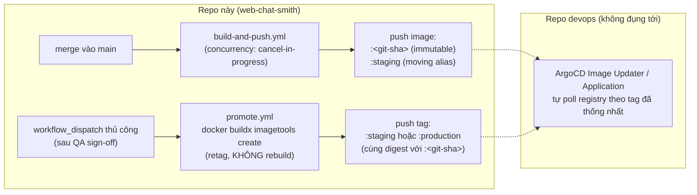

# Deployment — Docker, CI/CD, và điểm giao tiếp với devops (ArgoCD/GKE)

> Runbook cho pipeline build/deploy phía `apps/web`. Phần thuộc sở hữu của devops (ArgoCD Application, Helm/Kustomize manifests, Vault policy, GKE cluster config) nằm ở **repo khác**, không đụng tới ở đây — tài liệu này chỉ mô tả **điểm giao tiếp** (image nằm ở đâu, tag theo quy ước gì) để 2 phía tương tác trơn tru mà không cần đồng bộ liên tục. Xem thêm bối cảnh quy trình ở [`flags-and-release-workflow.md`](./flags-and-release-workflow.md).

## 1. Build once, deploy many

[`tools/docker/Dockerfile`](../../tools/docker/Dockerfile) build `apps/web` bằng multi-stage, **bun runtime end-to-end** (install, build, và chạy standalone server — không có Node ở bất kỳ đâu trong image). Mọi file liên quan Docker (Dockerfile, `.dockerignore`, và sau này docker-compose cho local dev/giả lập Vault) nằm gọn trong `tools/docker/` — build luôn chạy từ root với `-f tools/docker/Dockerfile .` (context vẫn là root, vì `turbo prune` cần thấy toàn bộ monorepo).

Pipeline: **1 image build đúng 1 lần mỗi commit** ([`.github/workflows/build-and-push.yml`](../../.github/workflows/build-and-push.yml)), tag theo git SHA, immutable — cùng 1 image được promote qua staging → production ([`.github/workflows/promote.yml`](../../.github/workflows/promote.yml)), không bao giờ build lại theo môi trường.

**Đã đảo ngược 1 quyết định trước đó**: bản nháp đầu của Dockerfile này dùng `node:22-alpine` cho runtime stage, dựa trên 1 phát hiện trước đây (`bun run server.js` gây `AbortError` lặp lại với `cacheComponents: true`, do `setTimeout()` của Bun). Re-verify trực tiếp lần này (cùng image, cùng bun 1.3.14, nhiều route PPR/dynamic khác nhau, có đợi) **không tái hiện được lỗi** — logs sạch, không warning "cannot guarantee Cache Components", không AbortError. Đã sửa lại dùng bun cho runtime theo đúng yêu cầu ban đầu. Nếu vấn đề này xuất hiện lại sau này, đó là 1 regression cần điều tra lại (có thể do version Bun/Next cụ thể tại thời điểm đó), không phải lý do để tự ý quay lại Node.

## 2. 2 bug thật đã gặp khi build image (đã fix, ghi lại để không lặp lại)

Cả 2 bug dưới đây **chỉ xuất hiện khi build trong Docker**, không xuất hiện khi chạy `bun run build` trực tiếp trên máy dev — dễ khiến "trên máy tôi chạy được" nhưng CI/Docker fail.

### 2.1 Turborepo strict environment mode âm thầm xoá `CS_PUBLIC_*`

`turbo build` (task trong `turbo.json`) mặc định chỉ tự động pass-through các biến môi trường khớp framework inference (`NEXT_PUBLIC_*` cho Next.js) — **không** nhận diện convention `CS_PUBLIC_*` của repo này. Hệ quả: `bun -bun next build` chạy trực tiếp thành công, nhưng lệnh giống hệt bọc qua `turbo build`/`bun run build` fail với lỗi `[@cs/env] Required server var "..." is missing` dù biến **thật sự có** trong `process.env` lúc đó — verify trực tiếp bằng cách so sánh 2 cách gọi.

**Fix**: `turbo.json`'s `build` task khai báo `"env": ["CS_PUBLIC_*"]` (đã áp dụng). Bất kỳ script CI nào gọi `turbo build`/`bun run build` (kể cả ngoài Docker) đều cần task này khai báo đúng, nếu không sẽ gặp lại lỗi y hệt.

### 2.2 Bun's isolated linker phá standalone output tracing của Next

Next's `output: "standalone"` (packages/next-config) dùng `@vercel/nft` để trace + copy chính xác các file cần thiết vào `.next/standalone`. Linker mặc định của Bun ("isolated") lưu nội dung thật dưới `node_modules/.bun/<pkg>@<version>/...` và tạo symlink tại `node_modules/<pkg>` — cấu trúc nested-symlink này khiến tracer bỏ sót một số dependency lồng nhau. Verify trực tiếp: container build xong, chạy standalone server → throw `Cannot find module '.../node_modules/.bun/next@.../node_modules/@swc/helpers/esm/_interop_require_default.js'` ngay request đầu tiên — dù chạy bằng `node` hay `bun`, vì đây là lỗi ở bước copy file lúc build, không liên quan gì đến runtime thực thi.

**Fix**: `bun install --frozen-lockfile --ignore-scripts --linker=hoisted` trong stage `installer` — chuyển sang layout `node_modules` kiểu npm truyền thống (không có `.bun` store), tracer xử lý đúng như với npm/yarn/pnpm. **CI cũng phải dùng `--linker=hoisted`** ([`ci.yml`](../../.github/workflows/ci.yml) đã áp dụng) để môi trường CI giống hệt production, không để bug này lọt qua CI xanh rồi mới lộ ra ở image thật.

**Đã verify end-to-end**: build image thật (bun runtime), chạy container, `curl` nhiều route (kể cả PPR/dynamic) ra HTTP 200 với HTML đầy đủ, log sạch không có `AbortError` lặp lại.

## 3. Không có biến môi trường build-time nào — tất cả đều runtime

**Toàn bộ `CS_PUBLIC_*` chỉ đọc lúc request (container đã chạy, Vault đã inject)** — Dockerfile không có `ARG`/`ENV` nào cho biến ứng dụng, `build-and-push.yml` không có `build-args`. Đây là nguyên tắc, không có ngoại lệ.

**Vì sao trước đó tưởng cần 1 biến build-time**: lúc build thử lần đầu, `next build` fail vì 1 số route bị **static-prerender lúc build** (không phải request-time), và trong cây render của route đó có code gọi `requireServerVar()` (`packages/env/src/helpers.ts`) ngay tại thời điểm prerender — cụ thể là 2 chỗ:

1. **`FlagsProvider`** (bọc layout `(workspace)`, xem `apps/web/app/(workspace)/layout.tsx`) — dù là `"use client"`, Next vẫn server-render nó lúc prerender static shell. `flagsEngine()` (`apps/web/lib/flags.ts`) trước đây luôn dựng `FlagAdapter` thật của Firebase, đòi hỏi config ngay cả khi chạy trên server (nơi không bao giờ thực sự cần Remote Config thật — `firebase/remote-config` là SDK chỉ chạy browser). **Fix**: thêm `serverNoopAdapter` — khi `typeof window === "undefined"`, trả engine dùng adapter no-op (mọi giá trị `source: "static"`, engine tự fallback về default) thay vì đụng Firebase. Hành vi giống hệt lúc trước (engine thật cũng chưa `init()` lúc SSR, cũng trả default) — chỉ là không còn gọi Firebase SDK trên server nữa.
2. **`app/firebase-messaging-sw.js/route.ts`** — comment gốc của file này đã ghi rõ ý định "config injected from runtime env at request time", nhưng dưới Cache Components, 1 Route Handler không đụng API nào request-specific (`cookies()`, `headers()`, `connection()`, ...) **mặc định vẫn bị static-prerender lúc build** giống 1 route UI bình thường (xác nhận qua tài liệu Next bundled kèm package: `node_modules/next/dist/docs/01-app/01-getting-started/15-route-handlers.md`) — trái với ý định đã viết trong comment. **Fix**: thêm `await connection()` (từ `next/server`) trước khi đọc env, buộc route này quay lại đúng behavior "chỉ chạy lúc request thật" mà comment đã mô tả.

Sau 2 fix trên, `next build` chạy sạch không cần bất kỳ giá trị `CS_PUBLIC_*` nào — đã verify trực tiếp bằng `unset` toàn bộ biến rồi build lại.

**Bài học áp dụng cho route mới**: nếu 1 Route Handler/Server Component cần đọc `CS_PUBLIC_*` hoặc bất kỳ giá trị nào chỉ có ở runtime thật, và code đó nằm trong 1 cây có thể bị static-prerender, phải chủ động opt-out static generation (`await connection()`, hoặc đọc `cookies()`/`headers()`) — không phải thêm build-time env var để "cho qua" bước build. Xem thêm pattern tương tự đã áp dụng cho 1 vấn đề khác ở [`api-client.md` §10](./api-client.md).

## 4. Điểm giao tiếp với devops (ArgoCD/GKE) — không đụng repo của họ

Repo này **dừng lại ở việc build + push image đúng tag**. Mọi thứ sau đó (ArgoCD `Application`, Helm/Kustomize values, GKE deployment spec, Vault policy) thuộc repo/quyền sở hữu của devops team — hợp đồng giao tiếp giữa 2 phía chỉ cần **quy ước tag ổn định**, không cần đồng bộ file qua lại:



- **Tag `:<git-sha>`** — immutable, là nguồn sự thật duy nhất cho "artifact nào ứng với commit nào". Đây là tag `promote.yml` verify tồn tại trước khi retag ([`promote.yml`](../../.github/workflows/promote.yml) bước "Verify the image exists").
- **Tag `:staging`** — moving alias, tự động trỏ theo mỗi merge vào `main` (mục đích: ArgoCD/Image Updater phía devops chỉ cần cấu hình poll đúng 1 tag cố định, không cần biết SHA nào).
- **Tag `:production`** — chỉ được set thủ công qua `promote.yml` sau khi QA sign-off — không bao giờ tự động.
- **Registry path**: `${GAR_LOCATION}-docker.pkg.dev/${GCP_PROJECT_ID}/${ARTIFACT_REPOSITORY}/web` — 3 giá trị này là GitHub Actions repo variables devops cung cấp (không hardcode trong workflow), vì đây là tài nguyên GCP do devops tạo/sở hữu.
- **Auth**: Workload Identity Federation (`GCP_WORKLOAD_IDENTITY_PROVIDER` + `GCP_SERVICE_ACCOUNT`, GitHub Actions secrets) — không dùng static service-account key JSON, tránh rủi ro rò rỉ credential dài hạn. Devops cấp quyền `artifactregistry.writer` cho service account này lên đúng repository, không cần cấp gì thêm ở phía GKE/ArgoCD.

**Những gì repo này KHÔNG làm, và không nên làm**: viết/sửa ArgoCD `Application` YAML, Helm chart, hay bất kỳ manifest nào sync vào GKE — những phần đó có ngữ cảnh (namespace, resource limit, ingress, secret mount) chỉ devops nắm đủ để quyết định đúng, và thay đổi ở phía đó không nên đi qua PR review của product team.

## 5. Checklist thiết lập lần đầu (phối hợp 1 lần với devops, sau đó tự vận hành)

1. Devops tạo Artifact Registry repository, cấp Workload Identity cho GitHub Actions của repo này.
2. Set GitHub Actions repo variables: `GAR_LOCATION`, `GCP_PROJECT_ID`, `ARTIFACT_REPOSITORY`.
3. Set GitHub Actions repo secrets: `GCP_WORKLOAD_IDENTITY_PROVIDER`, `GCP_SERVICE_ACCOUNT`.
4. Tạo GitHub Environment `production` với required reviewer (approval gate) — `promote.yml` đã reference `environment: ${{ inputs.environment }}`, GitHub tự chặn chờ approve khi target là `production`.
5. Devops cấu hình ArgoCD (phía repo của họ) poll tag `:staging` cho môi trường staging, `:production` cho prod — không cần thông tin gì thêm từ repo này sau bước này.
6. Bật branch protection trên `main`: required status check = job `check` trong [`ci.yml`](../../.github/workflows/ci.yml).

## 6. Local dev / giả lập luồng deploy

[`tools/docker/docker-compose.yml`](../../tools/docker/docker-compose.yml) giả lập đúng phần luồng deploy thuộc về repo này: build image thật (`tools/docker/Dockerfile`), chạy cạnh 1 Vault dev-mode container, và container `web` tự fetch secret từ Vault qua HTTP lúc start — giống hệt cách 1 pod GKE thật nhận runtime env từ Vault Agent Injector, chỉ khác cơ chế injection (ở đây là 1 script nhỏ, không phải Agent Injector thật). **Không** giả lập ArgoCD/GKE — nằm ngoài phạm vi repo này (mục 4).

Vận hành qua `bun run docker <command>` ([`tools/scripts/docker.ts`](../../tools/scripts/docker.ts)), không gọi `docker compose` trực tiếp — để mọi người dùng chung 1 cách gõ lệnh:

```
bun run docker up        # build (nếu cần) + start web + vault ở background
bun run docker logs       # follow logs tất cả service
bun run docker logs web   # follow logs riêng service web
bun run docker vault kv get secret/chatsmith-web   # xem secret hiện tại trong Vault
bun run docker sh         # mở shell vào container web
bun run docker restart web
bun run docker down       # dừng + xoá container
bun run docker reset      # down + xoá luôn image, rebuild sạch từ đầu
```

Kiến trúc 3 service:

- **`vault`**: `hashicorp/vault` dev-mode, tự unseal, expose `:8200` (UI + API), token `root`. **Lưu ý đã gặp lỗi thật**: `vault status` (dùng làm healthcheck) mặc định giả định `https://127.0.0.1:8200` khi thiếu `VAULT_ADDR` — dev server chỉ nghe HTTP, nên thiếu biến này làm healthcheck fail vĩnh viễn với lỗi "server gave HTTP response to HTTPS client". Đã set `VAULT_ADDR`/`VAULT_TOKEN` ngay trong `environment` của chính service `vault` (không chỉ ở service gọi tới nó) — cần cho cả `vault status` lẫn cho `bun run docker vault ...` (chạy `docker compose exec vault vault ...`, thừa hưởng env của container `vault`, không phải của service gọi lệnh).
- **`vault-init`**: one-shot, chạy [`seed-vault.sh`](../../tools/docker/seed-vault.sh), seed **từ chính `apps/web/.env.local`** (file dev đã dùng cho `bun dev`) vào `secret/chatsmith-web` — 1 nguồn secret cho local, không phải 2 nơi tách biệt phải giữ đồng bộ tay. Đọc từng dòng `KEY=value` (bỏ qua dòng trống/comment, tự bóc 1 lớp quote nếu có), không phân biệt `CS_PUBLIC_*` hay secret khác (`GUEST_SESSION_SECRET_KEY`, ...) — seed nguyên file. Nếu `.env.local` trống/thiếu, seed 1 stub tối thiểu (`CS_PUBLIC_ENV_NAME=dev`) để `web` vẫn boot được thay vì fail cứng. Chạy xong thì exit — `web` chờ `condition: service_completed_successfully` mới start.
- **`web`**: build từ `tools/docker/Dockerfile` như production, nhưng **override `entrypoint`** thành [`vault-entrypoint.ts`](../../tools/docker/vault-entrypoint.ts) (mount vào qua `volumes`, không copy vào image) — script này fetch secret từ Vault HTTP API, merge vào `process.env`, rồi mới exec lệnh production thật (`bun run apps/web/server.js`). Production image không hề biết Vault tồn tại — toàn bộ logic Vault chỉ sống ở tầng compose, đúng tinh thần "image không đổi giữa các environment".

**Yêu cầu `apps/web/.env.local` phải tồn tại** trước khi `up` — nếu chưa có, tạo bằng `cp apps/web/.env.example apps/web/.env.local` rồi điền giá trị dev thật. `bun run docker up` tự kiểm tra file này trước khi gọi `docker compose`, báo lỗi rõ ràng thay vì để Docker fail mơ hồ ở bước mount.

**Đổi port nếu 3000 đã bị chiếm** (vd. đang chạy `bun dev` local) — không cần sửa `docker-compose.yml`:

```
WEB_PORT=3050 bun run docker up
```

`web.ports` trong compose đọc `${WEB_PORT:-3000}` — mặc định vẫn 3000 nếu không set gì.

**Đã verify end-to-end** (nhiều lần, với `.env.local` thật của máy đang phát triển): `bun run docker up` → `vault` healthy → `vault-init` seed đúng toàn bộ key từ `.env.local` (đã xác nhận qua log liệt kê tên key, không log giá trị) → `web` fetch được từ Vault → mọi route kể cả `/firebase-messaging-sw.js` (route duy nhất thật sự cần `CS_PUBLIC_FIREBASE_AUTH_CONFIG` lúc request, mục 3) trả HTTP 200.

## 7. Troubleshooting

**Build local thành công, CI/Docker fail ở đúng bước `next build`?** Xem mục 2.1 — gần như chắc chắn là `turbo.json`'s `build` task thiếu `env`/`CS_PUBLIC_*` cho biến bạn vừa thêm.

**Container build xong nhưng crash ngay request đầu với `Cannot find module .../node_modules/.bun/...`?** Xem mục 2.2 — kiểm tra `bun install` trong Dockerfile có đang thiếu `--linker=hoisted` không (có thể bị xoá nhầm lúc "dọn dẹp" Dockerfile).

**`promote.yml` báo lỗi "nothing to promote"?** `image_sha` nhập vào chưa từng được `build-and-push.yml` build/push — kiểm tra Actions tab xem merge tương ứng đã chạy xong build chưa, dùng đúng full SHA của commit đó.

**`next build` lại fail đòi 1 biến `CS_PUBLIC_*` mới?** Đừng thêm build arg — xem mục 3: tìm code nào trong 1 route/component đang đọc biến đó mà bị static-prerender ngoài ý muốn, thêm `await connection()` (Route Handler) hoặc kiểm tra guard `typeof window === "undefined"` (component dùng chung server/client) để defer đúng ra request-time.
