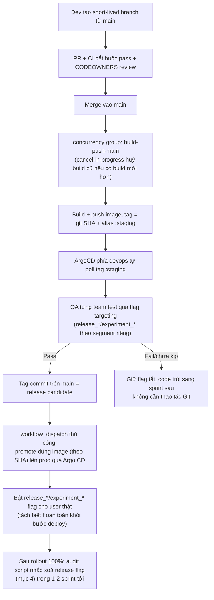

# Feature Flags & Release Workflow — quy ước vận hành

> Runbook cho quy trình phát triển đa team trên **1 Next.js app duy nhất** (`apps/web`), dùng chung 1 domain (`chatsmith.io`): quy ước flag/A-B testing qua `@cs/flags` + Firebase Remote Config, chiến lược Git, và pipeline CI/CD build-once-deploy-many. Kiến trúc chi tiết của `@cs/flags` (schema, adapter, React bindings) xem [`packages/flags/README.md`](../../packages/flags/README.md) — không lặp lại ở đây, tài liệu này tập trung vào **governance & quy trình**, phần mà README của package không (và không nên) trả lời.

## 1. Vì sao 1 app, không tách theo team

Nhiều product team (Chat, AI Tools, Workspace, …) cùng code trên `apps/web`, không tách thành nhiều Next.js app deploy dưới nhiều subpath. Lý do: team hiện tại 7-8 dev, tách app riêng biệt tạo ra chi phí infra, navigation cứng giữa các app, và duplicate code cao hơn giá trị "cô lập" mang lại ở quy mô này. Ranh giới giữa các team được giữ bằng **tooling**, không phải bằng service boundary:

- **Route ownership**: mỗi team sở hữu 1 route group (`(chat)/`, `(tools)/`, `(workspace)/`), có `layout`/`error`/`loading` riêng.
- **CODEOWNERS theo route group/package**: PR đụng route/package nào tự động request đúng người review, giảm việc dẫm chân nhau.
- **Chỉ chia sẻ qua `packages/*`** (xem `.claude/CLAUDE.md` mục "Monorepo Cross-Package Impact Check") — team này không được import thẳng internals của team kia.

Ngưỡng cân nhắc tách lại: team > ~15-20 dev, hoặc build time/CI trở thành bottleneck thật (đo được, không phải cảm tính).

## 2. `@cs/flags` — review kiến trúc hiện tại

Package đã tự giải quyết đúng phần **cơ chế** (đọc [`packages/flags/README.md`](../../packages/flags/README.md) để hiểu đầy đủ):

- **Schema là nguồn sự thật duy nhất** ([`schema.ts`](../../packages/flags/src/schema.ts)) — mỗi key khai báo 1 lần `{ decoder, defaultValue }`, mọi getter/hook/experiment suy ra từ đây, không có bảng type song song phải giữ đồng bộ tay.
- **Adapter cô lập Firebase** ([`adapters/firebase/adapter.ts`](../../packages/flags/src/adapters/firebase/adapter.ts)) — đây là **file duy nhất** import `firebase/remote-config`. `core/engine.ts`, `schema.ts`, `experiments/*` không biết Firebase tồn tại. Đổi provider (LaunchDarkly, Unleash, …) chỉ cần viết 1 `FlagAdapter` mới (`init` + `getRawValue`), không đụng phần còn lại.
- **`keys.ts`** đã có convention đúng: `REMOTE_CONFIG_KEYS` map 1:1 sang string key trên Firebase console, và đã tự ghi chú "không được đổi string value, chỉ được đổi tên identifier TypeScript" — đây chính là hợp đồng với console, giữ nguyên.
- **Code-splitting cho bundle size** đã được thiết kế sẵn: `Feature`/`ExperimentSwitch` tự bọc `<Suspense>` để mỗi variant có thể là `next/dynamic`, tránh việc cả 3 variant của 1 experiment cùng vào 1 bundle — README mục "Does having many flags/experiments bloat the bundle?" đã đo cụ thể bằng số (đây chính là bug `apps/super-app` từng gặp với `AccountSubscriptionModalV4`/`V5`, không phải rủi ro giả định).

**Khoảng trống thật sự — không phải ở cơ chế, mà ở governance**: `FlagSchemaEntry` ([`schema.ts:5-8`](../../packages/flags/src/schema.ts)) hiện chỉ có `decoder` + `defaultValue`. Không có chỗ nào trong code phân biệt "đây là release toggle của engineering, cần xoá sau khi rollout 100%" với "đây là A/B experiment của PO, có ngày kết thúc thí nghiệm". `REMOTE_CONFIG_KEYS` ([`keys.ts:8-32`](../../packages/flags/src/keys.ts)) hiện đang trộn chung 2 loại (`ENABLE_DESIGN_STUDIO_TOGGLE`, `FEATURE_PAYMENT_FLOW_V2` cạnh `PACKAGE_SUBSCRIPTION_UI_VERSION`, `WHATS_NEW_POPUP_OPTIONS`) không theo naming rule nào phân loại được bằng mắt hay bằng script. Đây là nguồn tech debt thật (quên xoá, bundle phình) — không đến từ việc dùng chung hạ tầng Firebase Remote Config cho cả 2 mục đích, mà từ việc thiếu metadata bắt buộc và thiếu naming convention.

## 3. Naming convention cho key (đề xuất)

Tách theo **prefix bắt buộc** trên string key Firebase (không đổi key cũ đã tồn tại — chỉ áp dụng cho key mới):

| Prefix | Ý nghĩa | Chủ sở hữu | Vòng đời |
| --- | --- | --- | --- |
| `release_*` | Kill-switch/rollout gate cho 1 feature đang phát triển | Engineering | Ngắn — xoá trong 1-2 sprint sau khi 100% rollout |
| `experiment_*` | A/B(/n) test đo hiệu quả | PO | Có ngày kết thúc thí nghiệm định trước |
| `config_*` | Remote config thuần (nội dung, ngưỡng số, danh sách) không phải toggle bật/tắt | PO/Eng tuỳ feature | Dài hạn, không cần xoá |

Ví dụ áp dụng vào key hiện có: `FEATURE_PAYMENT_FLOW_V2` → nếu là tính năng đang rollout dần thì nên là `release_payment_flow_v2`; `PACKAGE_SUBSCRIPTION_UI_VERSION` (đang dùng làm A/B qua `subscriptionUiExperiment` trong README) → nên là `experiment_subscription_ui_version`.

## 4. Metadata bắt buộc trên schema (đề xuất mở rộng `FlagSchemaEntry`)

Enforce structurally thay vì dựa vào tự giác — mở rộng `packages/flags/src/schema.ts`:

```ts
export interface FlagSchemaEntry<TValue> {
  decoder: FlagDecoder;
  defaultValue: TValue;
  type: "release" | "experiment" | "config";
  owner: string; // tên team, vd "chat", "workspace"
  // release: hạn xoá code; experiment: ngày kết thúc thí nghiệm
  expiresAt: string; // ISO date
  ticketUrl?: string; // issue tracker cho việc dọn dẹp
}
```

Vì `defineFlagSchema` đã là 1 hàm trung tâm ([`schema.ts:24-26`](../../packages/flags/src/schema.ts)), thêm field bắt buộc ở đây tự động bắt buộc mọi key mới trong `apps/web/lib/flags.ts` phải khai báo — TypeScript sẽ báo lỗi compile nếu thiếu, không cần convention bằng lời.

**Audit tự động**: thêm 1 script (cùng tinh thần `knip` đã dùng trong repo) chạy định kỳ (CI nightly hoặc sprint retro):

- Liệt kê flag có `type: "release"` và `expiresAt` đã qua nhưng vẫn còn reference trong code (`grep` theo `REMOTE_CONFIG_KEYS.<KEY>`) → tạo cảnh báo/issue.
- Liệt kê flag `type: "experiment"` đã qua `expiresAt` chưa có quyết định (giữ variant nào) → nhắc PO.

## 5. Giới hạn RSC của Firebase Remote Config

`firebase/remote-config` (client SDK, `catalog:integrations`, xem [`packages/firebase/package.json`](../../packages/firebase/package.json)) là **SDK chỉ chạy trong trình duyệt** — dựa vào `IndexedDB` để cache và fetch runtime, không hoạt động trong Server Components/Route Handlers. Đây không phải giới hạn của `@cs/flags`, mà là giới hạn vốn có của chính Firebase Remote Config JS SDK.

**Lưu ý dễ nhầm**: `FlagsProvider` ([`apps/web/components/providers/flags-provider.tsx`](../../apps/web/components/providers/flags-provider.tsx)) là `"use client"`, nhưng Next **vẫn server-render nó** như 1 phần của static shell lúc prerender (đúng cách Next xử lý mọi Client Component ở lần render đầu) — `"use client"` chỉ nghĩa là component _cũng_ chạy được ở browser, không phải "chỉ chạy ở browser". `apps/web/lib/flags.ts`'s `flagsEngine()` từng dựng `FlagAdapter` Firebase thật vô điều kiện, khiến build fail lúc prerender (đã verify, xem [`deployment.md` §3](./deployment.md)). **Fix**: `flagsEngine()` kiểm tra `typeof window === "undefined"` — trên server trả về engine dùng 1 adapter no-op (mọi giá trị `source: "static"`, engine tự fallback default), không đụng Firebase SDK. Hành vi output giống hệt trước đó (engine thật cũng chưa gọi `init()` lúc SSR nên cũng trả default) — chỉ khác là không còn cố khởi tạo Firebase App trên server nữa.

**Khuyến nghị: giữ nguyên client-only làm mặc định**, không cố lách sang RSC, vì 2 lý do:

1. App đang dùng Cache Components (`cacheComponents: true`) + PPR — runbook [`api-client.md` mục 10](./api-client.md) đã ghi nhận cụ thể: bất kỳ side-effect nào đụng network/`Date.now()` trong quá trình RSC prerender đều có rủi ro thật (`NEXT_PRERENDER_INTERRUPTED`, re-invoke nhiều lần). Gọi Remote Config (dù qua REST hay Admin SDK) trong RSC render path lặp lại đúng lớp rủi ro đó.
2. UI gate theo flag vốn đã phải code-split qua `<Suspense>` (mục 2) — nghĩa là phần phụ thuộc flag vốn đã là 1 client subtree render sau, không phải phần RSC render đồng bộ đầu tiên. Không có lý do UX để cố đưa flag lên RSC nếu nó vẫn phải đợi Suspense.

**Khi nào thực sự cần server-side** (SEO-critical content phụ thuộc flag, hoặc tránh layout shift): **không** gọi Firebase Remote Config trực tiếp trong RSC. Thay vào đó:

- Thêm 1 `FlagAdapter` mới (đúng extension point package đã thiết kế sẵn — mục "Adding a new provider" trong README) đọc từ 1 **cache đã materialize sẵn** (vd. 1 job định kỳ đẩy Remote Config template hiện tại vào Vault/KV cạnh edge), **không phải** live network call trong lúc render.
- `firebase-admin`'s server-side Remote Config template API hiện chưa được cài trong repo (`packages/firebase` chỉ có `firebase` client SDK) và tại thời điểm viết vẫn là tính năng còn thay đổi nhanh ở phía Firebase — nếu cân nhắc, verify trực tiếp với version SDK sẽ cài, không suy luận từ docs chung chung (theo nguyên tắc "verify against installed version" đã áp dụng cho các package khác trong repo này).

## 6. Git strategy: Trunk-based + Feature Flags

**Không dùng Gitflow.** Với nhiều team release theo sprint, feature có thể pass hoặc fail QA độc lập nhau — Gitflow buộc cherry-pick từng feature pass/fail vào 1 release branch chung, dễ lệch code và tốn công điều phối giữa các team không liên quan tới nhau.

**Chọn Trunk-based development**:

- `main` luôn ở trạng thái deployable — branch protection bắt buộc CI (lint/test/build) pass mới merge.
- Feature branch ngắn (1-2 ngày), PR thẳng vào `main`.
- Feature chưa xong / chưa QA pass → giấu sau `release_*` flag (mục 3), merge vào `main` với flag tắt. Không cần thao tác Git gì để "đẩy sang sprint sau" — code nằm im, chỉ cần chưa bật flag.
- Release = tag 1 commit trên `main` tại thời điểm QA sign-off, không phải 1 branch sống lâu.
- Hotfix prod: branch ngắn cắt từ tag đang chạy prod, fix, merge ngược lại `main`.

## 7. Staging dùng chung nhiều team

Chưa có preview-per-branch (kế hoạch năm sau của devops) → staging = **auto-deploy bản mới nhất của `main`**, dùng chung cho mọi team. Vấn đề cần giải: nhiều team cùng muốn QA test feature của mình trên cùng 1 staging mà không đụng nhau.

- **Flag phải hỗ trợ targeting theo request/segment ở tầng environment**, không chỉ 1 công tắc global cho cả staging — QA team A set 1 override (cookie/test-account) để chỉ họ thấy flag của họ bật, QA team B test song song không bị ảnh hưởng dù chung 1 build. Đây là điểm cần xác nhận/bổ sung khi tích hợp Firebase Remote Config conditions (theo user property/audience) thay vì chỉ theo environment.
- **Feature cần QA cô lập trước khi merge** (thay đổi rủi ro cao): trong lúc chưa có preview tự động, deploy thủ công build của branch đó vào 1 namespace GKE tạm thời qua `workflow_dispatch` — "preview nghèo" thủ công.
- **Schema/API chung**: 2 feature không liên quan UI nhưng đụng chung DB table/BE contract có thể phá nhau dù flag khác nhau — migration phải additive/backward-compatible khi feature còn chưa 100% rollout.
- **Regression chéo team**: cần smoke test/integration test tự động chạy sau mỗi lần deploy staging, vì mọi code (kể cả flag tắt) đều nằm chung 1 artifact.
- **1 app = 1 deployable unit**: deploy prod luôn ship code của mọi team cùng lúc. Vì vậy "deploy" tách biệt hoàn toàn khỏi "release" — team A không cần chờ 1 lần deploy riêng để ra mắt tính năng, chỉ cần bật `release_*` flag của họ sau khi artifact đang chạy đã chứa code đó.

## 8. CI/CD: build once, deploy many — tránh chồng chéo khi nhiều merge gần nhau

Đúng như lo ngại: nếu mỗi merge vào `main` tự động trigger build + push + auto-deploy riêng biệt, nhiều PR merge gần nhau (nhiều team, cùng lúc) sẽ tạo build chồng chéo, tốn CI runner, và có thể deploy nhầm thứ tự (build cũ hoàn thành sau build mới, ghi đè ngược). Giải quyết bằng **concurrency control ở tầng workflow**, không phải giảm tần suất merge:

```yaml
# .github/workflows/build-and-push.yml — đã hiện thực, xem file thật
concurrency:
  group: build-push-main
  cancel-in-progress: true
```

Chi tiết implementation đầy đủ (Dockerfile, workflow, quy ước tag, điểm giao tiếp với devops/ArgoCD) xem [`deployment.md`](./deployment.md) — mục dưới đây chỉ giữ lại phần lý luận "vì sao".

- Khi merge thứ 2 xảy ra trong lúc build thứ nhất đang chạy, GitHub Actions **tự huỷ job cũ**, chỉ chạy tới cùng cho job ứng với commit mới nhất. Vì mục tiêu của staging chỉ là "phản ánh đúng trạng thái mới nhất của `main`", build cũ bị huỷ giữa chừng không mất gì — không có ai cần kết quả của nó.
- **Prod không có vấn đề này**: deploy prod dùng `workflow_dispatch` thủ công, chọn đúng 1 image tag (git SHA) cụ thể — là hành động rời rạc do người vận hành chủ động chọn, không phải trigger tự động theo mỗi merge.
- **Argo CD (GitOps) tự nhiên debounce theo bản chất declarative**: Argo CD chỉ quan tâm "trạng thái Git hiện tại là gì", không phải "danh sách lệnh deploy cần chạy tuần tự" — nếu manifest repo bị đổi tag nhiều lần liên tiếp trong thời gian ngắn, Argo CD chỉ cần hội tụ về trạng thái cuối cùng, không cần xử lý từng thay đổi trung gian như 1 hàng đợi lệnh imperative (`kubectl apply` script viết tay mới có rủi ro này).
- **Turbo remote caching** giảm chi phí ngay cả khi build có chạy chồng lấn thật (vd. 2 build khác nhánh không cancel được nhau vì concurrency group khác) — bước nào không đổi thì cache hit, không rebuild từ đầu.
- Image tag theo git SHA, immutable — không dùng tag `latest`/tên branch, để không có tình huống "tag nào thắng" mơ hồ.

## 9. Sơ đồ tổng hợp



## 10. Checklist khi tạo 1 flag mới

1. Xác định `type`: `release` (engineering, kill-switch) hay `experiment` (PO, A/B) hay `config` (mục 3).
2. Đặt key theo prefix tương ứng trong `keys.ts` (`REMOTE_CONFIG_KEYS`), không đổi string value nếu key đã tồn tại trên Firebase console.
3. Khai báo đủ `decoder`, `defaultValue`, `type`, `owner`, `expiresAt` (mục 4) trong `defineFlagSchema` ở `apps/web/lib/flags.ts`.
4. Nếu gate 1 component không nhỏ → dùng `next/dynamic` cho từng nhánh, không import tĩnh cả 2 (mục 2/README "Does having many flags/experiments bloat the bundle?").
5. Nếu là `release` flag → tạo sẵn ticket dọn dẹp (link vào `ticketUrl`) ngay lúc tạo flag, không đợi tới lúc rollout xong mới nhớ ra.
6. Nếu là `experiment` → PO xác nhận trước ngày kết thúc thí nghiệm (`expiresAt`) và tiêu chí thắng/thua.

## 11. Troubleshooting / FAQ

**Vì sao không tách app riêng cho từng team?** Xem mục 1 — team hiện tại quá nhỏ để chi phí tách app (infra, navigation, duplicate code) đáng giá hơn rủi ro conflict code, vốn có thể giảm bằng CODEOWNERS/route ownership.

**Vì sao không dùng `release/*` branch làm môi trường staging?** Trong trunk-based, staging là trạng thái hiện tại của `main`, không phải 1 branch riêng cần quản lý song song — xem mục 6/7.

**Feature đã merge vào main nhưng chưa muốn ai thấy, có an toàn không?** Có, miễn là nằm sau `release_*` flag đang tắt — đây chính là lý do dùng flag thay vì giữ branch tách biệt lâu dài.

**2 team cùng test trên staging có ghi đè flag của nhau không?** Không, nếu flag targeting theo segment/override đúng cách (mục 7) — mỗi QA session chỉ ảnh hưởng tới override của chính họ, không đổi giá trị global.

**Vì sao không đọc Firebase Remote Config trong Server Component?** Xem mục 5 — SDK hiện tại (`firebase/remote-config`) không chạy được trên server, và ngay cả khi có giải pháp server-side, việc gọi network side-effect trong lúc RSC prerender (Cache Components) có rủi ro đã ghi nhận thật ở [`api-client.md`](./api-client.md) mục 10.
